# DHCP(Dynamic Host Configuration Protocol)

우선적으로 DHCP 서버는 클라이언트 디바이스에 IP를 부여하여 주는 서버입니다.  
이해를 돕기 위하여 아래의 네트워크 패킷을 통하여 설명하겠습니다.

_Bios 환경에서는 패킷을 확인할 수 없기 때문에, DCHP로부터 IP를 발급 받은 서버에서 IP를 재발급하는 과정을 캡쳐하였으며, 명령어는 아래와 같습니다._
```
ipconfig /release

ipconfig /renew
```


1. 디바이스에 꼽힌 이더넷 랜선에서 255.255.255.255로 브로드 캐스트 통신을 시도하여 DHCP 서버가 해당 네트워크 환경에서 존재하는지 확인합니다.
2. 해당 패킷을 받고 DHCP 서버는 현재 발급 가능한 IP를 요청이 들어온 디바이스에 패킷으로 전달하여 줍니다.
3. 디바이스는 해당 IP를 확인하는 후, IP 발급 요청을 담은 패킷을 DHCP 서버에 전송합니다.
4. 최종적으로 DHCP는 IP를 할당한 후, 발급 결과를 디바이스에 전달하며 이후로부터 디바이스는 해당 IP로 네트워크에서 통신하기 시작합니다.

</br>

# DHCP 설치(WorkGroup)
_AD 조인을 안한 DHCP 서버입니다._

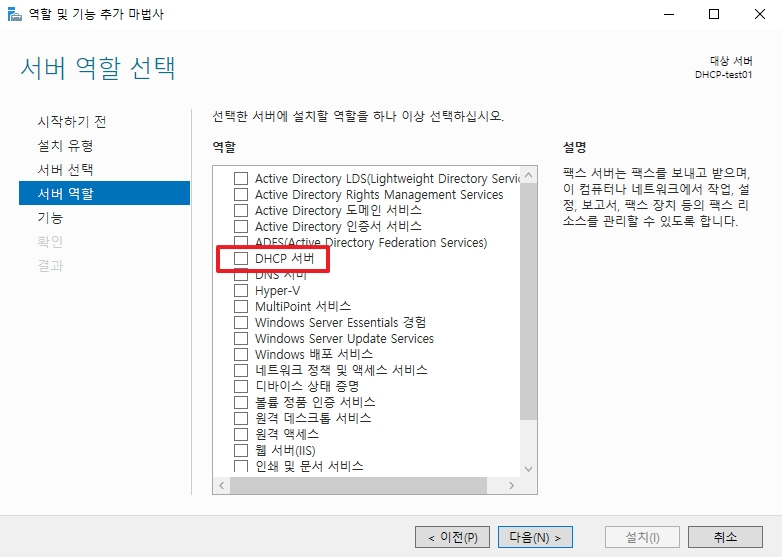
* DHCP 서버 역할을 추가합니다.

</br>

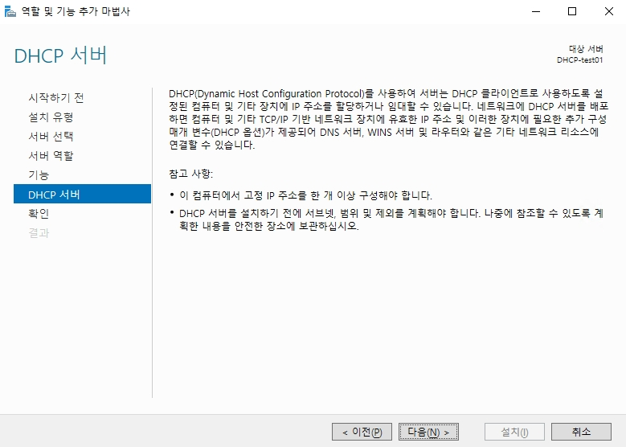
* 해당 내용을 참고한 후, 다음으로 넘어갑니다.

</br>

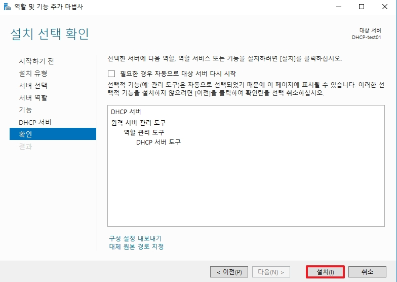
* 역할 및 기능들을 확인한 후, 설치합니다.

</br>

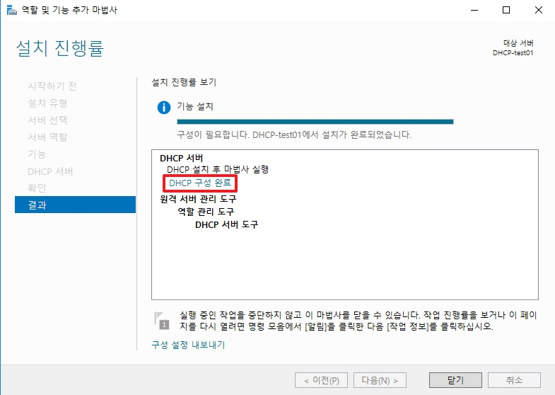
* DHCP 설치가 끝난 후, `DHCP 구성을 완료` 추가 설정을 진행합니다.

</br>

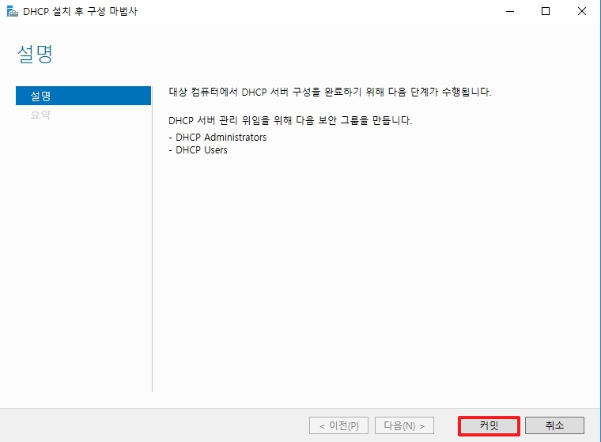
* 커밋을 클릭하여, `DHCP Administrators` 그룹과 `DHCP Users` 그룹을 생성합니다.

</br>

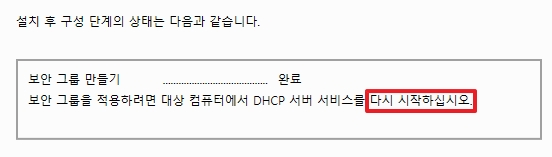
* 보안 그룹을 생성한 후, DHCP 서버를 재부팅합니다.

</br>

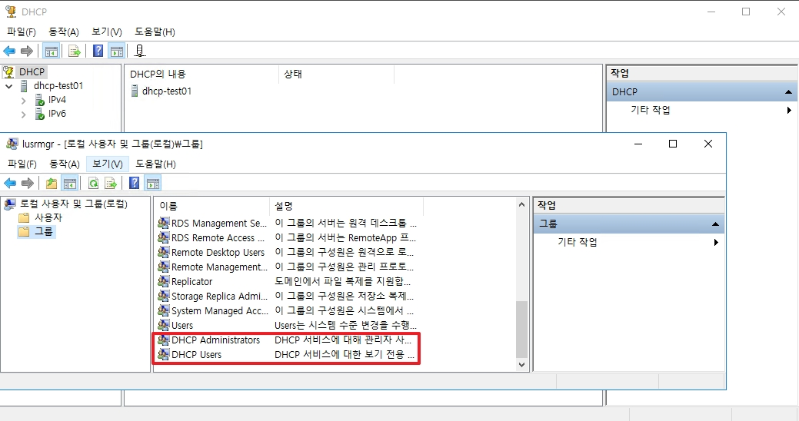
* 재부팅 후, `lusrmgr.msc` 에서 생성된 로컬 보안 그룹들을 확인합니다.

</br>

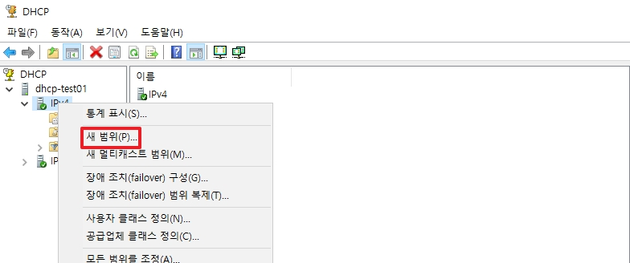
* DHCP 도구에서 `DHCP 서버명` -> `IPv4` -> 우 클릭 -> `새 범위`로 이동합니다.

</br>

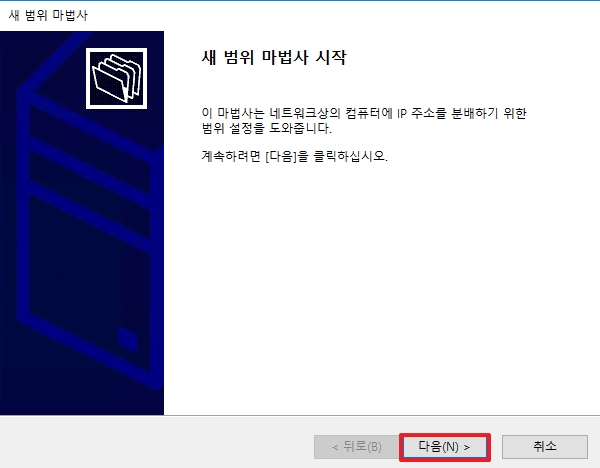
* 다음으로 넘어갑니다.

</br>

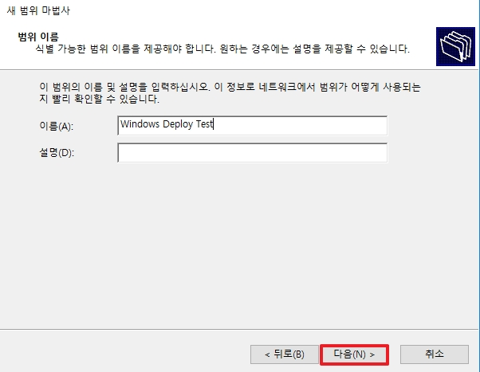
* 범위명을 입력합니다.

</br>

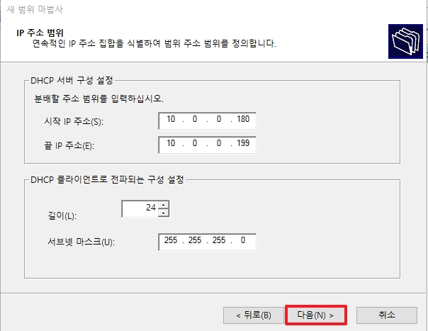
* DHCP가 발급할 수 있는 네트워크 범위를 설정합니다.

</br>

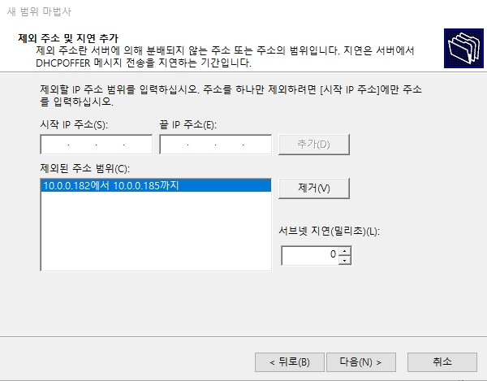
* 허용된 네트워크 범위 안에서도 제외할 범위가 있다면 추가로 설정합니다.

</br>

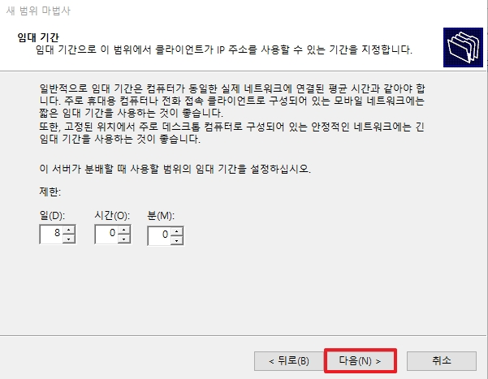
* DHCP가 디바이스에 IP를 임대하여 주는 임대 기간을 설정합니다.

</br>

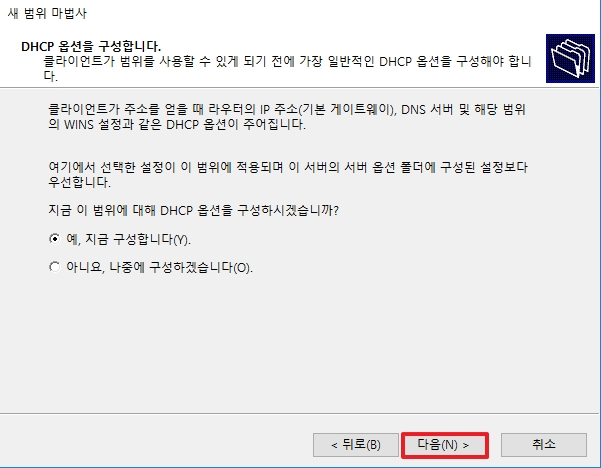
_DHCP는 단순히 IP만을 발급하는 것이 아닌 초기 디바이스의 네트워크 세팅 값의 구성에 관여할 수 있습니다._
* 예를 선택한 후, 다음으로 넘어갑니다.

</br>

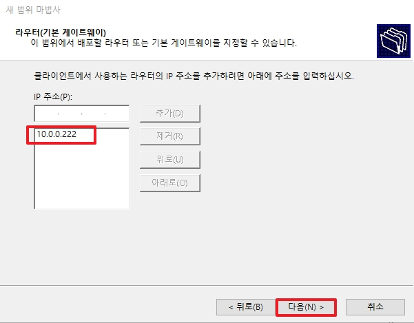
* 기본 게이트웨이 값을 설정합니다.
* 해당 값은 `ncpa.cpl` -> `속성` -> `인터넷 프로토콜 버전(TCP/IPv4)`의 `기본 게이트웨이` 값을 미리 설정할 수 있습니다.

</br>

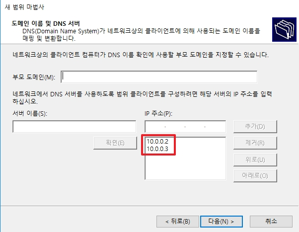
* DHCP 서버에 등록된 DNS 서버가 자동으로 등록되며, DNS 추가 및 우선순위를 편집 할 수 있습니다.

</br>

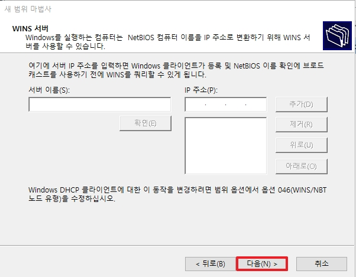
* Wins 서버를 추가해서 OS 설치 시에 이미지를 가져올 수 있습니다.
* 해당 기능은 추후에도 설정 할 수 있음으로 다음으로 넘어갑니다.

</br>

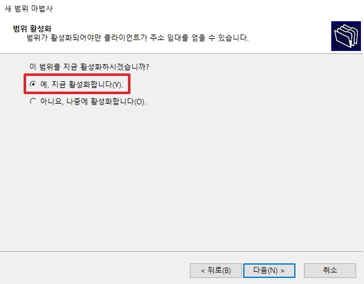
* DHCP 서버 기능을 바로 활성화 합니다.

</br>

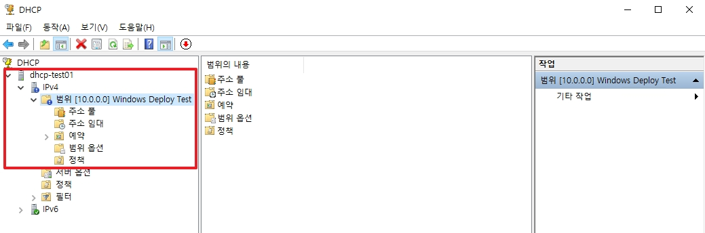
* 범위 목차에 해당 새 범위가 추가된 것을 확인할 수 있습니다.

</br>

### ++추가) 범위 옵션 추가

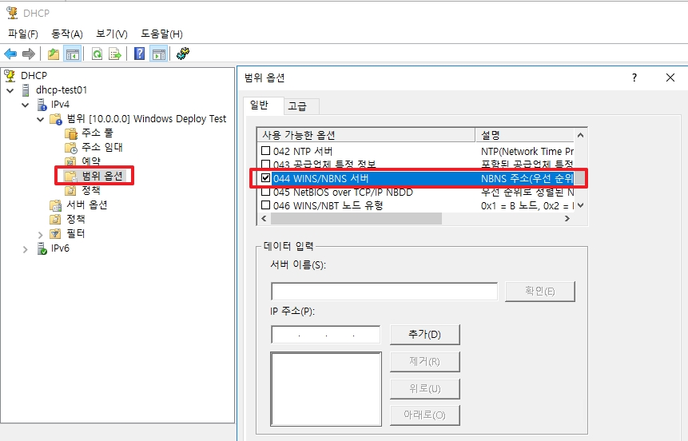
* 이전에 추가하지 못하였던 WINS 서버를 추후에도 추가할 수 있습니다.
* 추가 시에는 `WINS/NBNS 서버`와 `WINS/NBT 노드 유형`이 필요합니다.

</br>

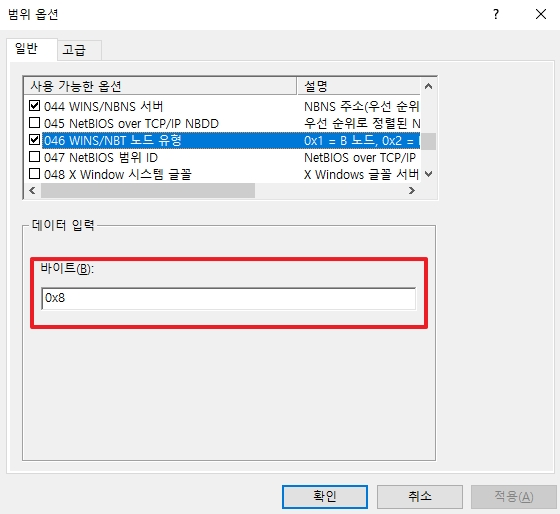  
[참고] [NetBiosNodeType Enum](https://learn.microsoft.com/en-us/dotnet/api/system.net.networkinformation.netbiosnodetype?view=net-9.0)

* 추가 특이사항으로는 0x8 값은 Hybrid Type을 뜻하며, 먼저 NBNS를 사용한 다음 NetBIOS 이름 쿼리를 사용하여 IP 주소 탐색을 시도합니다.

</br>

# DHCP 설치 (AD Member Server)
_AD 도메인에 가입된 서버일 경우는 옵션 값이 조금 다릅니다._  
DHCP 서버가 AD인증을 받아야하기 때문에 달라진 점만 보겠습니다.

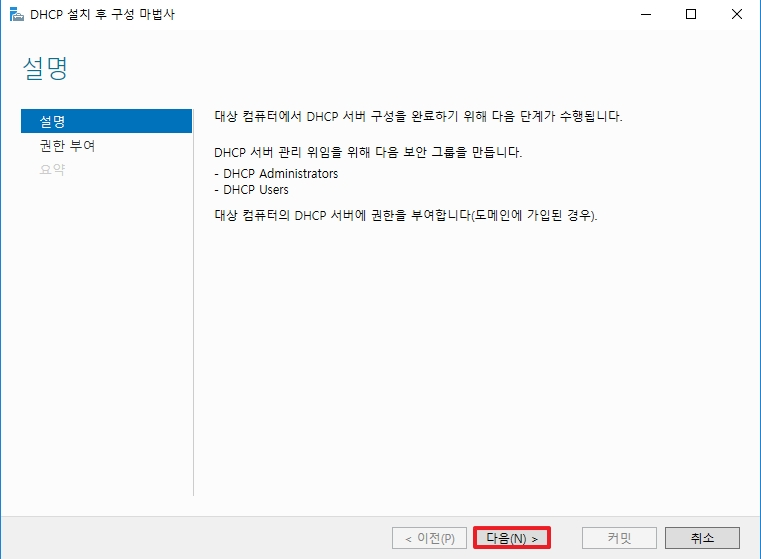
* 기존 Workgroup에서는 커밋이 활성화 되었지만, 다음으로 이동합니다.

</br>

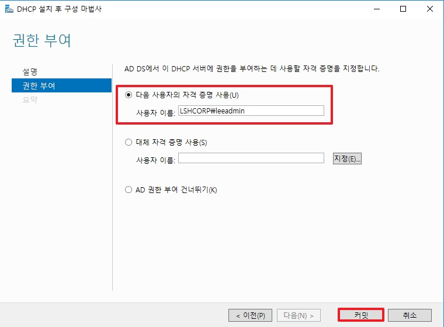
* 해당 DHCP 서버가 DHCP 서버 역할을 할 수 있도록 자격 증명 계정을 사용합니다.

</br>

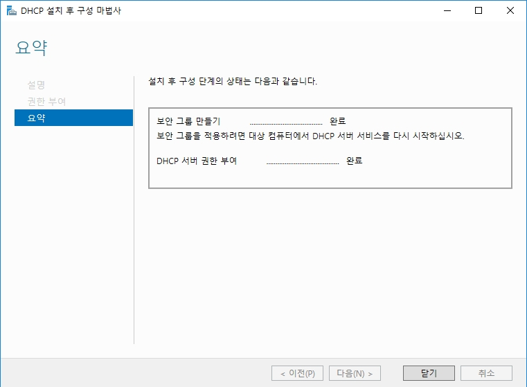
* 보안 그룹과 DHCP 서버 권한 부여에 성공하면 위와 같이 출력됩니다.

</br>

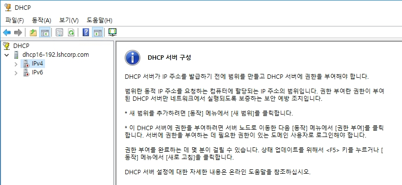
* 권한 인증이 안되어 있을 경우, DHCP 서비스를 재시작하거나 `서버명` -> 우 클릭 -> `권한 부여`에서 위에서 등록한 권한이 적용되어 있는지 확인합니다.

</br>

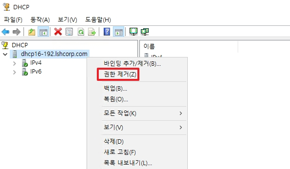
* 정상적으로 권한이 부여되어 적용되었다면 위와 같이 출력됩니다.

</br>

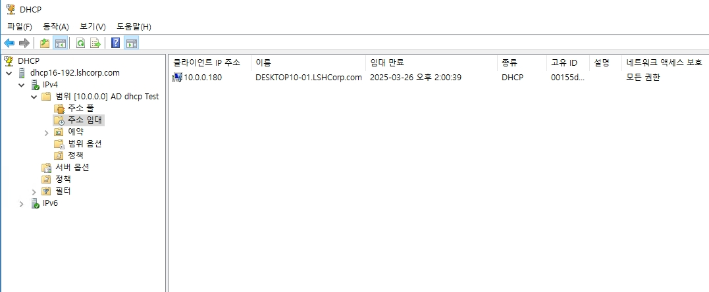
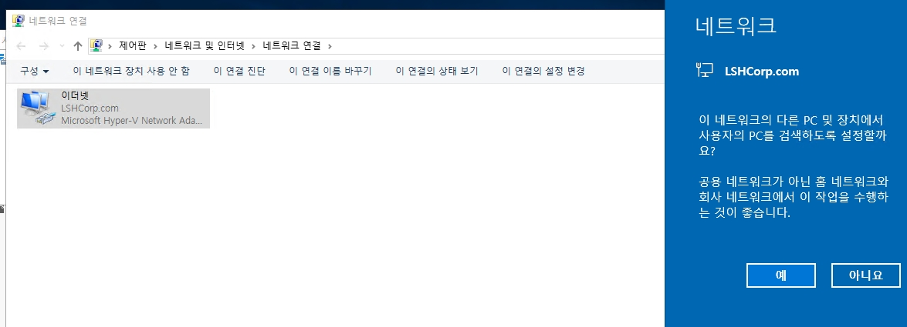
* AD에 가입된 DHCP 서버라고 하여, Client에서 추가로 더 해야할 작업은 없습니다.
* ncpa.cpl에서 `자동으로 IP 주소 받기`를 하면 위와 같이 출력됩니다.

</br>