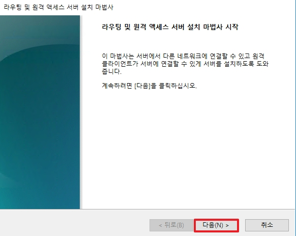

# NAT(Network Address Translation)

NAT는 쉽게 이야기 하여 IP를 변환입니다. 그렇다면 여기서 어떤 경우에서 IP를 변환시켜야 할까요?  
바로 하나의 공인 IP가 있고, 해당 네트워크에서 트래픽이 전부 공인 IP 하나로 나가야 될 경우에 많이 사용합니다.  
따라서 NAT는 아웃바운드 유형으로 사용되어지며, DHCP 서버에서 NAT를 같이 사용하는 경우가 많기 때문에 이와 관련하여 설정 방법을 설명하겠습니다.

 

# 1. DHCP Server NAT 설정

* 역할에서 `원격 엑세스`를 설치합니다.

 

* 다음으로 넘어갑니다.

 

  
_라우팅을 설치하면 자동으로 DirectAccess를 설치해야합니다._

* `DirectAccess 및 VPN(RAS)`와 `라우팅`을 같이 설치합니다.

 

* 설치 완료 후, 닫기를 클릭합니다.

 

* `서버관리자` -> `도구` -> `라우팅 및 원격 엑세스`로 이동합니다.

 

* 서버명을 우 클릭하여 `라우팅 및 원격 엑세스 구성 및 사용` 을 클릭합니다.

 

* 다음으로 넘어갑니다.

 

|NAT(네트워크 주소 변환)|사용자 지정 구성|
|:---:|:---:|
|||
* `NAT` 옵션을 선택하여 구성하여도 되지만, 사용자 지정 옵션에서 `NAT`와 `LAN 라우팅` 서비스를 선택하여도 됩니다. 

 

* 공용 인터페이스를 사용하여 인터넷에 연결합니다.

 

* 마침을 클릭하여 NAT 서비스를 설치합니다.

 

* 설치가 완료된 후, `서버명` -> `IPv4` -> `NAT`로 이동합니다.

 

|Internal DHCP|Internet|
|:--:|:--:|
|||
|||
* NAT 인터페이스 속성과 `ncpa.cpl` 네트워크 설정을 위와 같이 설정합니다.

 

### 테스트 결과

#### [인프라 구조]  

* DHCP 서버로 부터 192.0.0.11 IP를 할당 받은 PC가 NAT를 통하여 정상적으로 외부 172.0.0.2 서버와 통신하는 모습을 확인할 수 있습니다.

