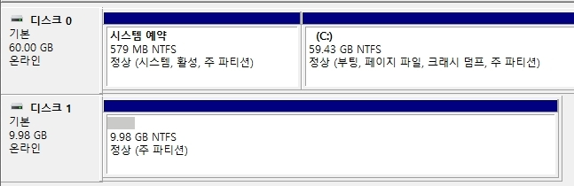

# Windows PE

Windows PE는 일반 OS 이미지와 달리 Windows 부팅만을 위해서 사용되는 휘발성 이미지이며, RAM에서 동작합니다.  
PC 사용 후 재부팅 시, 디스크에 저장되지 않는 데이터는 저장 되지 않습니다.

</br>

# 1. 환경 설정


* ISO 파일을 저장할 F 드라이블를 추가합니다.

</br>


* 현재 테스트 하는 환경은 Win10 1903입니다.

</br>

  
[Link] [https://learn.microsoft.com/ko-kr/windows-hardware/get-started/adk-install](https://learn.microsoft.com/ko-kr/windows-hardware/get-started/adk-install)

* Windows OS에 맞는 `ADK`와 `PE 추가 기능`을 다운로드 합니다.

</br>


* ADK를 먼저 관리자 권한으로 설치합니다.

</br>


* 로컬 PC에 설치합니다.

</br>


* 데이터 전달을 허용하지 않습니다.

</br>


* 라이센스에 동의합니다.

</br>


* `배포 도구` 관련 기능을 모두 활성화 후, 설치합니다.

</br>


* ADK 설치에 완료합니다.

</br>


* PE 추가 기능 설치를 관리자 권한으로 실행합니다.

</br>


* 로컬 PC에 PE 기능을 설치합니다.

</br>


* 데이터 전달을 허용하지 않습니다.

</br>


* 라이센스에 동의합니다.

</br>


* Windows PE 기능을 설치합니다.

</br>


* 모든 설치가 완료되었습니다.

</br>

# 2. Windows PE ISO 파일
PE를 이용하여 부팅


* `시작`에서 관리자 권한으로 배포 및 이미징 도구 환경을 실행합니다.

</br>


```bash
cd \
```
* C:\ 경로로 이동합니다.

</br>


```
copype amd64 C:\WinPE_amd64
```
* PE 명령어를 통하여 부팅 이미지를 `C:\WinPE_amd64` 경로에 생성합니다.

</br>


```bash
MakeWinPEMedia /iso C:\WinPE_amd64 F:\NewWinPE.iso
```
* 부팅 이미지를 F 드라이브에 `NewWinPE.iso` iso 파일로 생성합니다.

### ++ 추가)
부팅 USB로 생성이 필요한 경우 아래의 명령어 옵션에서 사용가능합니다.  
[Link] [https://learn.microsoft.com/en-us/windows-hardware/manufacture/desktop/makewinpemedia-command-line-options?view=windows-11](https://learn.microsoft.com/en-us/windows-hardware/manufacture/desktop/makewinpemedia-command-line-options?view=windows-11)

</br>


* 생성된 ISO 파일을 확인합니다.

</br>


* 생성된 ISO 파일을 Hyper-v에 연결시켜 테스트를 진행합니다.
* 1세대 VM이면, BISO에서 CD 부팅이 최우선 순위입니다.

</br>


* 아무 버튼이나 입력하여 iso파일로 Windows PE 부팅을 시도합니다.

</br>


* 부팅에 정상적으로 성공 시, 위와 같이 화면이 출력됩니다.

</br>

# PE 부팅 - Network 설정
PE 부팅을 하여 OS를 캡쳐한 후, 외부에 이미지를 저장하기 위해서는 네트워크를 사용해야합니다.  
여기서는 DHCP가 아닌 고정 IP에서 설정하는 방법을 설명합니다.  

</br>


```bash
netcfg -winpe
```
* WinPE에서 네트워크를 사용할 수 있도록 네트워크 어댑터 드라이버를 로드합니다.

</br>


```bash
wpeutil initializenetwork
```
* PE 환경에서 네트워크 서비스를 시작합니다.

</br>


```bash
netsh
int
ipv4
```
* `netsh 유틸리티`를 사용해 IPv4 인터페이스 설정을 구성하는 하위 모드로 진입합니다.

</br>


```bash
# set address name="[이더넷명]" source=static address=[IP] mask=[서브넷] gateway=[게이트웨이]
set address name="Ethernet" source=static address=10.0.0.178 mask=255.255.255.0 gateway=10.0.0.1
show config
```
1. show config으로 ipv4를 설정할 이더넷 명을 찾습니다.
2. 이더넷명을 찾은 후, 해당 이더넷에 IPv4 값을  설정합니다.

</br>


* `exit` 명령어로 netsh 설정에서 나온 후, ping을 통하여 다른 서버들과 통신이 되는지 확인합니다.

</br>