# `DISM`(Deployment Image Servicing and Management)
DISM은 Windows 이미지를 캡쳐, 적용 및 복구 하는데 사용하는 명령줄 도구입니다.  
서비 신규 구축 및 이미지 손상 복구에 많이 사용하기 때문에 기본기로 익혀두면 좋습니다.  

* Windows 10 -> 11 마이그레이션 작업이 있어서 캡쳐 및 복구 Demo는 Windows 11 이미지를 사용합니다. 

</br>

# 1. Image Capture
_아래의 Demo에서는 Network 설정 내용을 생략합니다._ (필요할 경우, 12챕터 참고)
* 아래 과정은 서버 혹은 PC를 Sysprep하여 OOBE 상태로 종료한 이후 과정을 설명합니다.

## 1-1. Windows PE 부팅

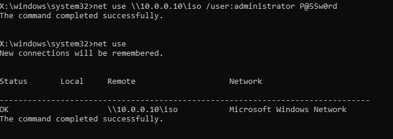
```bash
# net use \\10.0.0.10\iso /user:administrator P@55w0rd
net use \\10.0.0.10\iso /user:administrator P@55w0rd
netuse
```
* 위 명령어를 통하여 SMB로 파일서버에 있는 공유 폴더에 매핑합니다.

</br>

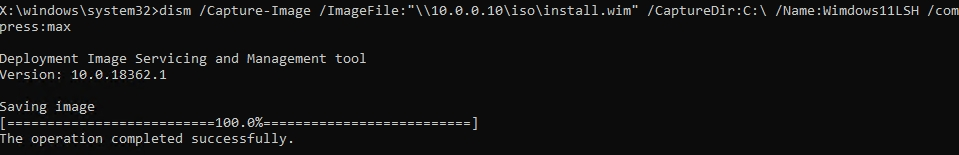
```bash
# Dism /Capture-Image /ImageFile:"[네트워크 공유 폴더 경로]" /CaptureDir:[캡쳐할 볼륨] /Name:[인덱스명] /compress:max
Dism /Capture-Image /ImageFile:"\\10.0.0.10\iso\install.wim" /CaptureDir:C:\ /Name:Windows11LSH /compress:max
```
_-compress 압축 옵션을 안 하면 "네트워크 공유"는 중간에 끊기거나 에러가 발생합니다._
* 위 명령어를 통하여 네트워크 공유 폴더에 현재 Sysprep된 이미지를 저장합니다.

</br>

## 1-2. Windows 미디어 부팅
WindowsPE가 아닌 일반적인 ISO 혹은 부팅 과정에서 F11 등으로 시스템 복구(WinRE) 환경으로 진입하는 것을 뜻합니다.  
_OOBE에서 일반화를 진행하였어도, 다음 부팅에서 WinRE로 진행하면 이전 내용이 남아있습니다.(초기 설정 시에 일반화가 적용됨)_

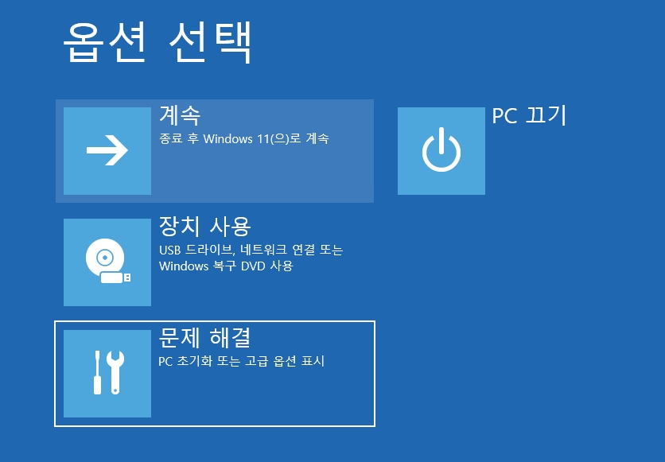
* Windows 부팅 중, F11을 입력하여 WinRE로 진입합니다.

</br>

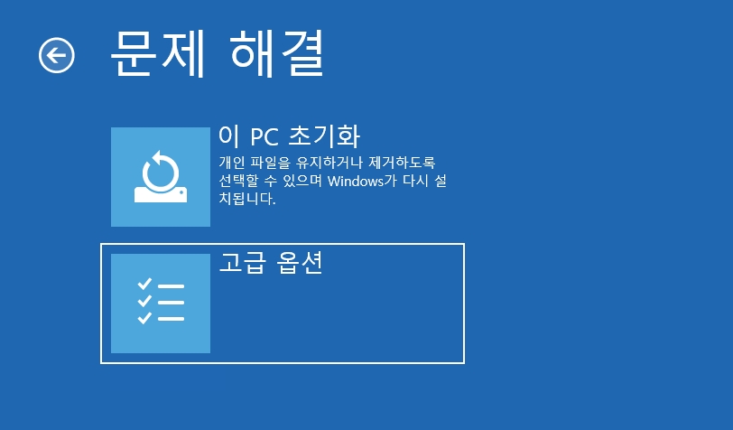
* 고급 옵션으로 이동합니다.

</br>

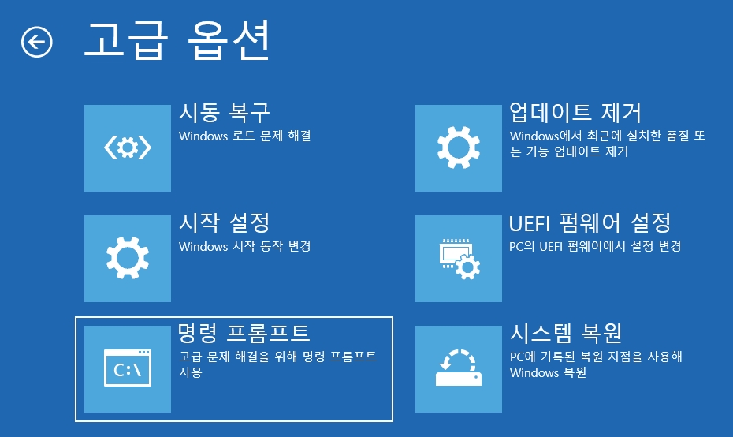
* 명령 프로프트를 실행합니다.

</br>

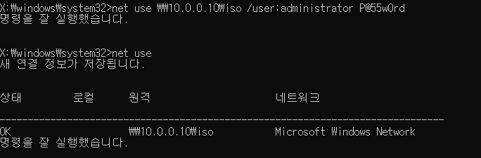
```bash
# net use \\10.0.0.10\iso /user:administrator P@55w0rd
net use \\10.0.0.10\iso /user:administrator P@55w0rd
netuse
```
* 위 명령어를 통하여 SMB로 파일서버에 있는 공유 폴더에 매핑합니다.

</br>

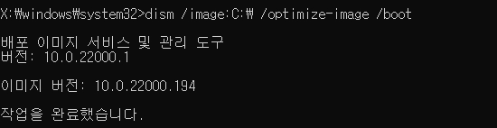
```
dism /image:C:\ /optimize-image /boot
```
* 초기 부팅 시에 조금 더 빠르게 부팅할 수 있도록 최적화 명령어입니다.
* 위 명령어는 선택 사항이지만, `Windows PE 부팅에서는 위 명령어 실행이 불가능합니다.`

</br>

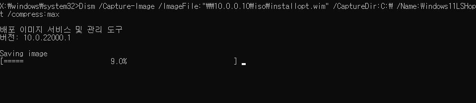
```bash
# Dism /Capture-Image /ImageFile:"[네트워크 공유 폴더 경로]" /CaptureDir:[캡쳐할 볼륨] /Name:[인덱스명] /compress:max
Dism /Capture-Image /ImageFile:"\\10.0.0.10\iso\install.wim" /CaptureDir:C:\ /Name:Windows11LSH /compress:max
```
_-compress 압축 옵션을 안 하면 "네트워크 공유"는 중간에 끊기거나 에러가 발생합니다._
* 위 명령어를 통하여 네트워크 공유 폴더에 현재 Sysprep된 이미지를 저장합니다.

</br>

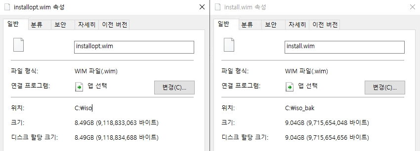
* `/optimize-image /boot` 옵션을 실행한 wim파일이 이미지 용량이 작습니다. 

</br>

# 2. Image Apply
* Windows 11을 기준으로 설명하기 때문에 BIOS가 아닌 `UEFI`로 설명합니다.

## 2-1. Windows Partition Overview

### [BIOS Partition]
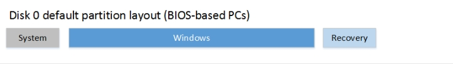

### [UEFI Partition]
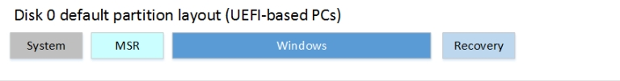  
[Reference] [https://learn.microsoft.com/ko-kr/windows-hardware/manufacture/desktop/configure-uefigpt-based-hard-drive-partitions?view=windows-11](https://learn.microsoft.com/ko-kr/windows-hardware/manufacture/desktop/configure-uefigpt-based-hard-drive-partitions?view=windows-11)

* `System`: 시스템 파티션은 부팅에 사용되는 파티션이비다.
    * 최소 크기는 200MB로, FAT32 파일 시스템을 사용합니다.

* `MSR`: Microsoft 예약 파티션, Bare Metal 혹은 OS에서 메타 데이터 임시 저장 등으로 사용하는 파티션입니다.
    * 필수는 아니지만 16MB로 사용합니다.

* `Windows`: 실제로 Windows가 저장되는 C:\ 볼륨 파티션입니다.
    * NTFS 파일 시스템을 사용하며, 64bit는 최소 20GByte 이상, 32bit는 16GByte 이상이 필요합니다.

* `Recovery`: Windows RE(Windows 복구 환경)에서 사용하는 파티션입니다.
    * 일반적인 PC에 Windows 11 설치 시, 850 ~ 1000Mbyte 정도 사용합니다.

</br>

## 2-1. DISM Image Apply