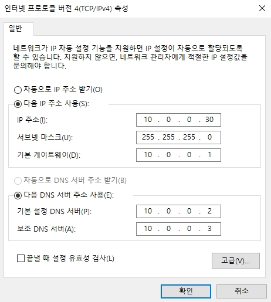
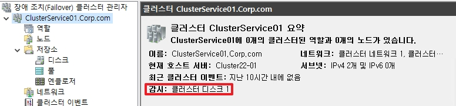

# Failover Cluster

Windows Server에서는 기본적으로 제공하는 `고가용성 서비스`인 Failover Cluster가 있습니다.  
블록 스토리지(SAN Disk)를 사용하여, 공유 디스크로 구축하며 제일 많이 사용되는 영역은 `MS SQL의 이중화`에 사용됩니다.  
여기서는 FCI(MS SQL)까지는 하지 않고 어떤 서비스도 올릴 수 있도록 기초적인 Failover Cluster 구축만 설명합니다.  

</br>

# 1. 기본 설정

## 1-1. 네트워크 설정

||내부망|하트비트|
|:--:|:--:|:--:|
|Active|||
|Stand-By|||
* AD에 가입되어 있는 내부망 이더넷은 `게이트웨이`와 `DNS`를 설정합니다.
* 여기서 인터넷 메트릭을 설정하여 내부망이 하트비트 보다 우선순위가 될 수 있도록 낮은 값을 설정합니다.

추가적으로 HearBeat망에서는 아래의 IPv4 설정을 추가해야합니다.  
또한 하트비트망은 방화벽에서 echo를 허용하여 서로 ping이 가능하게 해야합니다.

|DNS|WINS|
|:--:|:--:|
||


</br>

## 1-2 블록 스토리지 추가
_위 Demo에서는 SAN 대신에 ISCSI 파일 서버를 통하여 구축하였습니다._  
_모든 노드에서 진행합니다._


* 도구에서 ISCSI 초기자를 클릭합니다.
* _추가로 역할 및 기능에서 설치하지 않아도 됩니다._


* "예"를 클릭합니다.


* 블록 스토리지를 호스팅하는 대상 IP를 입력합니다.


* 입력 후, 빠른 연결을 클릭합니다.


* 정상적으로 연결 되었다면, 


* 실행창에서 `diskmgmt.msc`를 입력합니다.
* 디스크를 온라인한 후, 파티션을 초기화하고 볼륨을 설정합니다.


* 모든 설정이 끝난 후, Active에서 디스크들을 오프라인하여 Stand-by node에서도 디스크가 온라인 되는지 확인합니다.
* 디스크 letter를 Active Node와 Stand-By Node가 같을 수 있도록 설정합니다.

</br>

## 1-3. Failover Cluster 기능 설치


* `장애 조치(Failover) 클러스터링`과 `도구`를 같이 활성화합니다.
* _`도구`가 없다면 powershell 명령어를 통하여 Cluster Log가 수집되지 않습니다._


* Active와 Stand-By 모든 Node에 역할을 설치합니다.

</br>

# 2. Failover Cluster 설정


* 장애 조치 클러스터 관리자에서 새 클러스터를 생성합니다.

</br>


* 다음으로 넘어갑니다.

</br>


* 클러스터 서비스에 노드가 될 서버들을 추가합니다.

</br>


* 유효성 검사 보고를 위해 `예`를 선택합니다.

</br>


* 다음으로 넘어갑니다.

</br>


* 모든 테스트를 실행합니다.

</br>


* 다음으로 넘어갑니다.

</br>


* 유효성 검사 테스트를 진행합니다.
* 추후에도 기억해야 할 부분은 이 검사는 디스크 검사를 진행할 때, 디스크를 오프라인 했다가 온라인 하는 작업을 진행합니다. 따라서 클러스터 위에서 `서비스를 운영 중에 유효성 검사 테스트를 진행하면 절대 안됩니다.`

</br>


* 유효성 검사가 끝난 후, 다음으로 넘어갑니다.

</br>


* 클러스터 서비스 명과 서비스가 사용할 IP를 설정합니다.

### ++추가)

* 클러스터 서비스는 AD에서 개체로 생성되어지며, `CNO`라고 부릅니다.

</br>


* 디스크 저장소 추가르 선택한 후, 다음으로 넘어갑니다.

</br>


* 클러스터를 생성합니다.

</br>


* 클러스터 생성 결과를 확인합니다.

</br>


* 장애 조치 클러스터 관리자에 접속하여 생성된 클러스터를 확인합니다.

</br>


* `저장소` -> `네트워크` 탭으로 이동합니다.
* 실제로 서비스를 하는 내부망의 경우에는 `이 클라이언트가 이 네트워크를 통해 연결할 수 있음`을 활성화하고, 하트비트의 경우 이 옵션을 비활성화합니다.

</br>

# 3. Quorum 쿼럼

Failover Cluster는 쉽게 설명하면 `과반수의 서버`가 Online 형태로 이루어질 때, `Online`이 되어진 서버로 Failover하면서 서비스를 `고가용성`으로 유지하는 개념입니다.  
위와 같이 2-node로 진행하게 되면 한 쪽 서버가 온라인이고, 다른 서버가 오프라인이라고 가정하게 되면 1:1 비율로 이미 과반수가 아니게 됩니다.  
따라서 쿼럼이란 것을 만들어 `쿼럼을 온라인 과반수`에 포함시키어 서비스를 유지할 수 있도록 하는 개념입니다.

그렇기 때문에 2node, 4node 형태로 `node는 짝수`로 이루어지게 구성하며, 이에 쿼럼을 구성하는 권장하는 값입니다.


* `클러스터 서비스 명` -> 우 클릭 -> `추가 작업` -> `클러스터 쿼럼 설정 구성`으로 이동합니다.

</br>


* 다음으로 이동합니다.

</br>


* 쿼럼을 이 관리할 노드를 추가합니다.

</br>


* `디스크 감시 구성`을 선택합니다.

</br>


* 쿼럼 용으로 사용할 디스크를 선택합니다.
* _약 1GByte 정도로 설정합니다._

</br>


* 클러스터 쿼럼을 생성합니다.

</br>


* 위와 같이 쿼럼으로 사용되는 디스크는 할당 대상이 쿼럼 디스크로 변경됩니다.

</br>



```
Get-ClusterQuorum -Cluster [클러스터 서비스명] | FL *
```
* 쿼럼이 어떻게 구성되어 있는지 확인이 가능합니다.

</br>