# WSL(Windows Subsystem for Linux)

Windows에서 Linux 명령어 혹은 bash 사용할 수 있게 해주는 WSL 기능에 대해서 설명합니다.  
Windows에서 굳이 Linux를 사용해야 하는 이유는 Docker 컨테이너 때문이라고 생각하며 해당 기능에 중점을 두어 WSL2 위주로 WSL를 설명합니다.  

## WSL1과 WSL2의 차이
WSL2를 알아보기 전, 1과 2의 차이점에 대해서 우선적으로 살펴 보아야 합니다.  

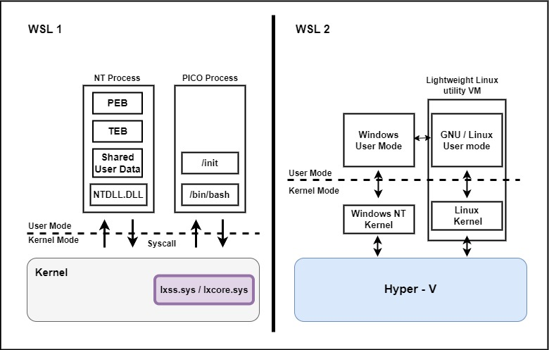
* `WSL 1`: 위 버전은 쉽게 얘기하면 기존 NT Process들과 다른 독립적으로 경량화된 PICO Process를 사용합니다.
    * Windows와 같은 File System인 NTFS에서 동작하며, `lxss.sys`와 `lxcore.sys`를 통하여 Windows kernel에서 동작합니다.
    * 같은 File System을 사용하는 만큼 속도 면에서 우위를 가져가지만, 모든 Linux 명령어를 Windows에 맞게 위 모듈이 파싱 해야 하기 때문에 명령어에 제한이 있습니다.

* `WSL 2`: WSL은 속도는 빨랐으나 명령어가 Native하지 못하다는 단점이 있었다. 이를 보완하기 위하여 경량화된 VM을 사용하는 WSL2를 사용하게 됩니다.
    * WSL2는 Hyper-v를 기반으로 사용하지만 정확하게는 Hyper-v의 기능을 단편적으로 사용하며, Hyper-V 역할을 설치하지 않습니다.
    * WSL2 설치 시, `VirtualMachinePlatform`이 해당 Hyper-V에 단편적인 가상화 기능입니다.
    * Docker와 같은 리눅스 컨테이너 사용 시, 명령어 호환성때문에 WSL2를 사용하게 됩니다.

<br>

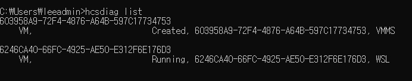
```
hcsdiag list
```
* 위 명령어는 현재 Hyper-V에서 실행 중인 VM 인스턴스들을 출력하는 명령어이다.
* 따라서 WSL2도 경량화 VM으로 실행될 때, Hyper-V를 사용하는 것을 확인할 수 있다.

<br>

# WSL2 Install
WSL2를 폐쇄망에서 설치하는 과정을 다룹니다.  
_MS Store에서 Linux 이미지를 사용하여 설치하면 좋겠지만 대부분의 회사는 폐쇄망임으로 폐쇄망에서 설치하는 과정을 다룹니다._
* [Link] [https://learn.microsoft.com/ko-kr/windows/wsl/install-manual](https://learn.microsoft.com/ko-kr/windows/wsl/install-manual)

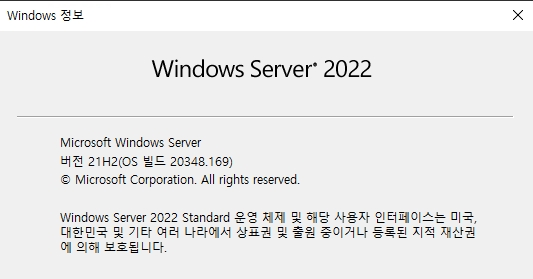
```
winver
```
* Windows Server 2019 - 빌드 18362.1049 이상에서 설치 가능합니다.
* _2019는 1809와 1903 두 가자지 버전이 있으며, 1809에서는 설치가 불가능하기 때문에 1903 혹은 Windows Server 2022 이상으로 가야햡니다._

<br>

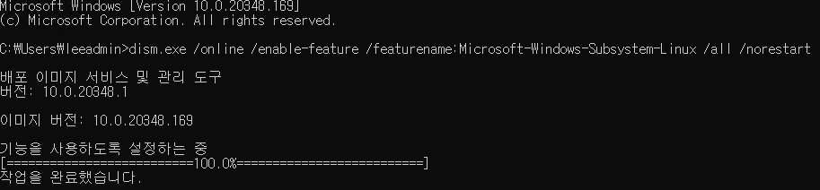
```
dism.exe /online /enable-feature /featurename:Microsoft-Windows-Subsystem-Linux /all /norestart
```
* 위 명령어를 실행하여 Linux용 Windows 하위 시스템을 설치합니다.
* 서버 관리자 역할의 기능 추가에서 `Windows Subsystem for Linux`으로 설치 가능합니다.

<br>

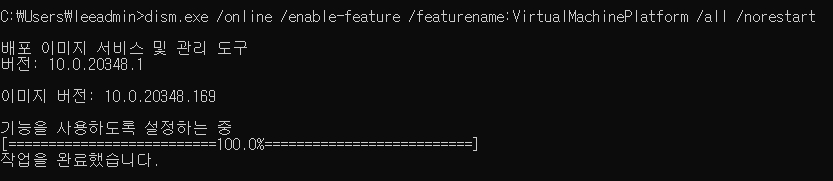
```
dism.exe /online /enable-feature /featurename:VirtualMachinePlatform /all /norestart
```
* 가상 플랫폼 기능을 설치합니다.
* 해당 기능 설치 이후, 서버를 재부팅합니다.

<br>

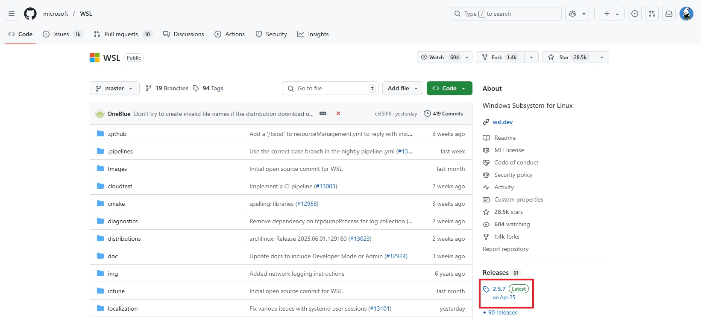  
[Link] [https://github.com/microsoft/WSL](https://github.com/microsoft/WSL)

* 위 과정은 Windows Server OS에 내장되어 있는 `C:\Windows\System32\wsl.exe`를 사용하는 방식이 아닌 신규 WSL 새로 설치하여 사용하는 방식입니다.
* 위와 같이 사용하는 것이 최신 wsl 명령어 등을 반영하여 사용할 수 있습니다.

<br>

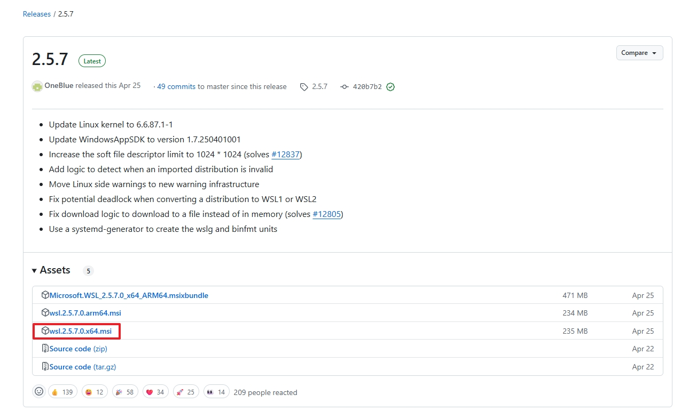
* x64bit의 msi파일을 다운로드합니다.

<br>

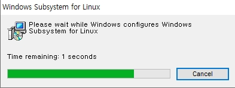  
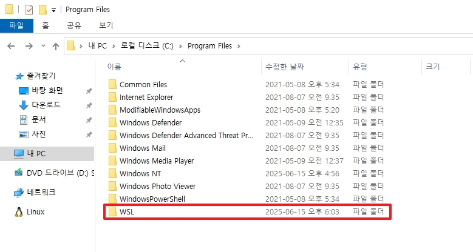
* 위 파일을 실행한 후, 정상적으로 설치가 되면 `C:\Program Files` 하위에 신규 `wsl.exe`가 생성되게 됩니다.

<br>

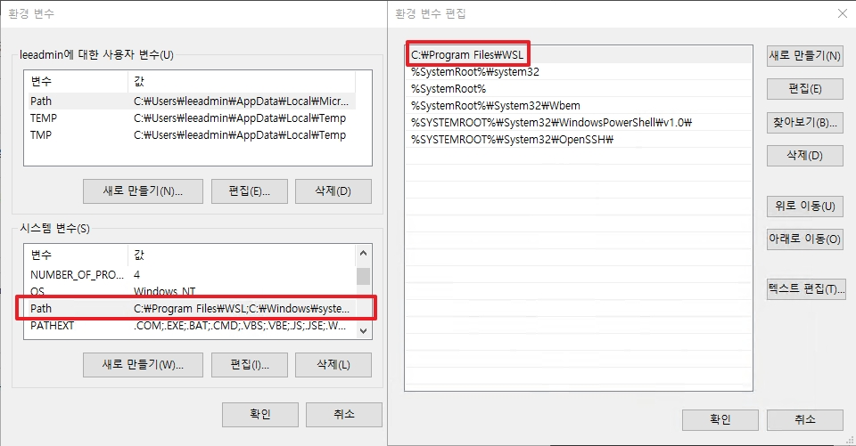
* OS에 2개의 wsl.exe가 생겼기 때문에 신규 wsl.exe를 호출하기 위하여 시스템 환경 변수를 편집해야합니다.
* `C:\Program Files`를 `C:\Windows\System32` 우선 순위보다 높게 하여 저장합니다.

<br>

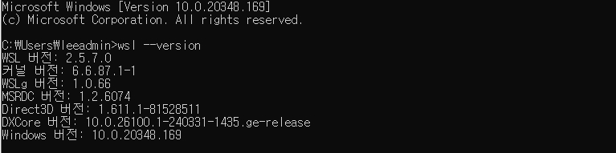
```
wsl --version
```
* 정상적으로 설치되었을 경우, 위와 같이 설치한 WSL 버전이 출력됩니다.

<br>

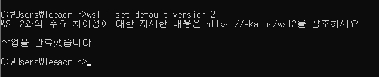
```
wsl --set-default-version 2
```
* WSL 사용을 버전2로 변경합니다.

<br>

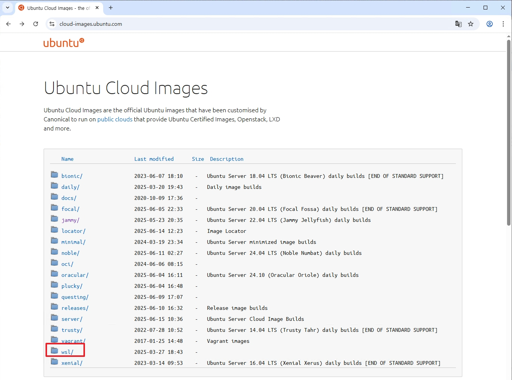  
[Link] [https://cloud-images.ubuntu.com/](https://cloud-images.ubuntu.com/)
* 위 링크에서 `WSL` -> `Jammy`로 이동합니다.

<br>

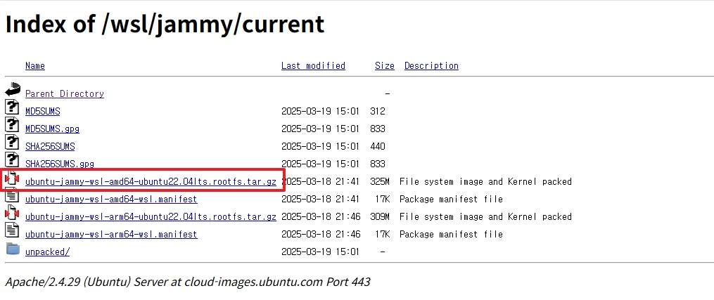  
* 위 링크에서 커널용 64bit 우분투 이미지를 다운로드 합니다.

<br>

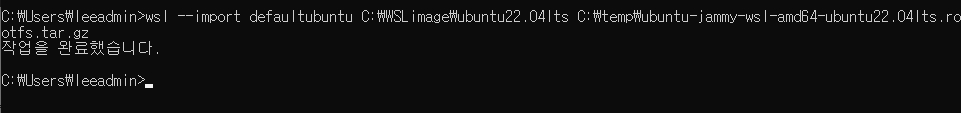
```bash
# 명령어
wsl --import [이미지 인덱스명] [디렉토리 설치할 위치] [설치에 사용할 이미지 경로]

# 예시
wsl --import defaultubuntu C:\WSLimage\ubuntu22.04lts C:\temp\ubuntu-jammy-wsl-amd64-ubuntu22.04lts.rootfs.tar.gz
```
* 위 명령어를 입력하여 WSL에 우분투 이미지를 설치합니다.


## ++추가)

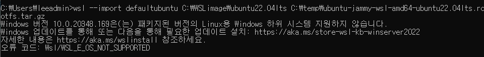
* 위와 같이 WSL이 출력된다면 OS 빌드 버전이 낮기 때문임으로 최신 LCU로 업데이트하면 됩니다.

<br>


```
wsl -l -v
```
* 위와 같이 설치한 이미지 인덱스명 및 WSL 버전이 출력되면 정상적으로 설치를 마칩니다.

<br>

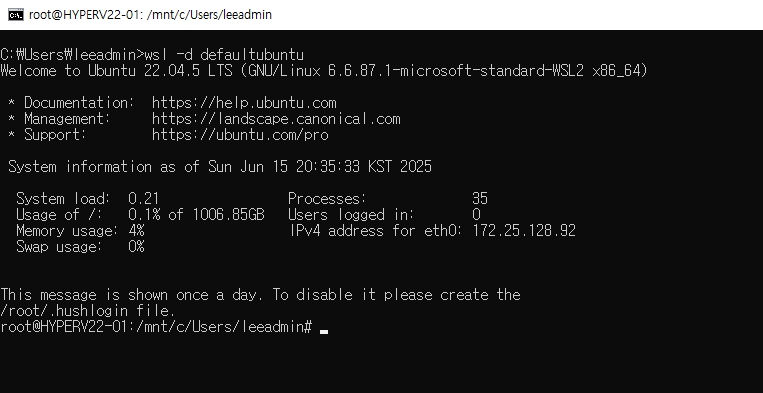
```
wsl -d [이미지 인덱스명]
```
* 마지막으로 위와 같이 명령어를 실행하면 WSL2를 통하여 우분투 실행이 가능합니다.
* _기본적으로는 C를 마운트하기 때문에 보안상 추후 설정이 필요합니다._