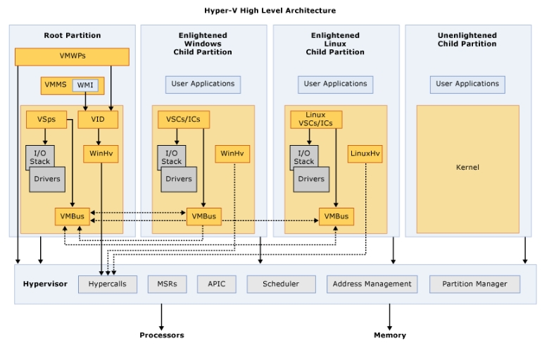
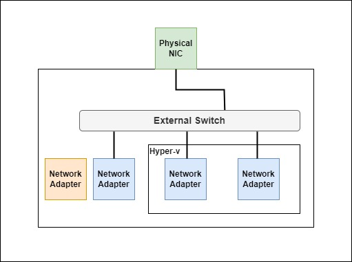
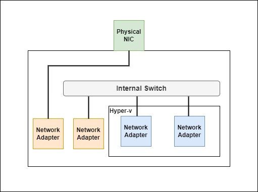
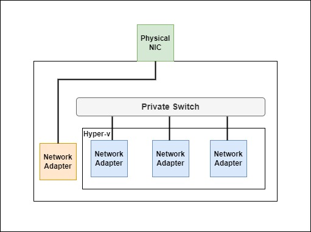
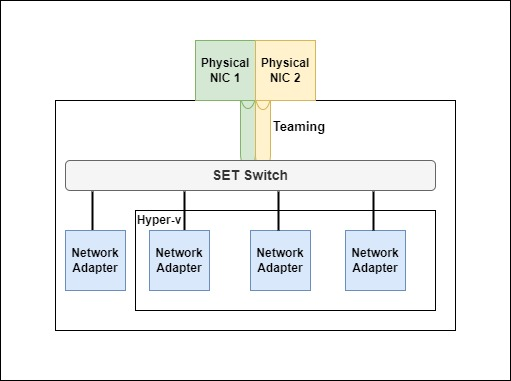

# Hyper-V

Windows Server 가상화 솔루션입니다. 이번 챕터에서는 Hyper-v를 하나씩 설명하기 보다는 실제로 현업에서 필요하였던 내용을 위주로 기록할 예정입니다.

  
[Link] [https://learn.microsoft.com/en-us/virtualization/hyper-v-on-windows/reference/hyper-v-architecture](https://learn.microsoft.com/en-us/virtualization/hyper-v-on-windows/reference/hyper-v-architecture)

Windows OS에 Hyper-v를 설치하게 되면 부팅이 기존과 다르게 동작하게 됩니다.  
서버가 부팅되면 OS가 올라오는게 아니라 Hyper-V가 먼저 실행된 후, Hyper-v가 호스트 서버의 OS를 Root Partition으로 할당하여 부팅되게 됩니다.
* 좀 더 섬세하게 이야기 하면 Hypervisor가 먼저 올라온 후, Windows는 더 이상 “bare metal”에서 직접 실행되지 않고,
Root Partition이라는 특수한 VM 위에서 동작합니다.

<br>

# 목차 

1. 가상 스위치

<br>

# 1. 가상 스위치
## 1. 외부 네트워크

  
* 외부 네트워크에 가상 스위치와 브릿지 형태를 만들어 VM에서 외부와 통신해야할 때 주로 사용합니다.

## 2. 내부 네트워크

  
* Host 서버가 VM 네트워크 내부와 통신해야 할 경우에 주로 사용합니다.

## 3. 개인 네트워크

  
* Host 서버가 VM 네트워크에 접속하지 못하도록 해야할 경우에 주로 사용합니다.

## 4. SET Teaming

  
[Link] [https://learn.microsoft.com/en-us/azure/azure-local/concepts/host-network-requirements?view=azloc-2505&context=%2Fwindows-server%2Fcontext%2Fwindows-server-edge-networking](https://learn.microsoft.com/en-us/azure/azure-local/concepts/host-network-requirements?view=azloc-2505&context=%2Fwindows-server%2Fcontext%2Fwindows-server-edge-networking)

* Hyper-v에서는 기존에 사용하던 LBFO Teaming을 사용하지 못 합니다. (_챕터 2 참조_)
* 따라서 `SET(Switch Embedded Teaming)` 스위치를 생성하여 해당 스위치를 NIC와 Teaming하여 사용하고 Host도 Hyper-v 기반의 가상 어뎁터를 할당 받아 사용하게 됩니다.
* 참고할 점은 SET는 `Switch Independent 모델`로 `LACP와 같은 스위치 프로토콜을 사용하지 못 합니다.`
    * _실제로 LACP로 연결한 후, SET 스위치를 생성하게 되면 통신이 안됩니다._

### __SET 스위치 생성 명령어__
```powershell
# 명령어

New-VMSwitch -Name "[SET 스위치 명]" `

             -NetAdapterName "[어뎁터1]","[어뎁터2]" `

             -EnableEmbeddedTeaming $true `

             -AllowManagementOS $true

 

# 예시

New-VMSwitch -Name "SETSwitch" `

              -NetAdapterName "Ethernet1","Ethernet2" `

              -EnableEmbeddedTeaming $true `

              -AllowManagementOS $true
```
* `-Name`: 생성할 가상 스위치 이름
* `-NetAdapterName`: 팀을 구성할 NIC 어뎁터명
* `-EnableEmbeddedTeaming $true`: SET 사용 여부(해당 옵션을 통하여 SET로 생성합니다.)
* `-AllowManagementOS $true`: Hyper-v 호스트 OS도 해당 스위치로 통신 가능 여부(기본 값은 true입니다.)

위 명령어를 통하여 SET 스위치를 생성하여 사용할 수 있게 됩니다.