# RRAS(Routing and Remote Access Service) with Site-to-Site VPN

해당 문서에서는 Site와 Site를 서로 VPN으로 묶는 방법에 대해서 설명할 예정입니다.  
Azure에서는 Virtual Network Gateway를 사용하여 VPN을 형성하지만, On-premise에서는 장비 단에서 IKEv2 프로토콜을 사용하여 통신하게 됩니다.  
하지만 장비가 없을 경우, 소프트웨어적으로 구현할 수 있게 RRAS를 사용하여 구현할 예정입니다.

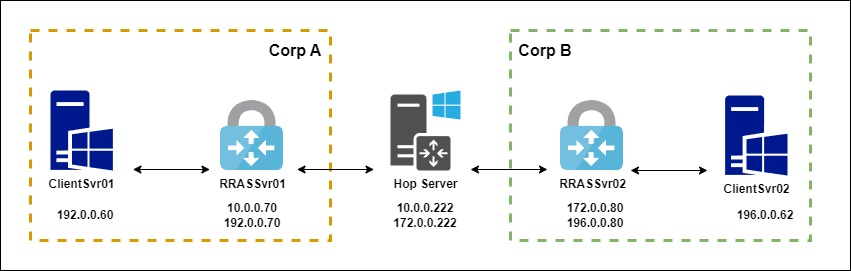

</br>

# 목차

[1. Hop 서버 설정](#1-hop-서버-설정)  
[2. RRAS 설치 - Corp A](#2-corp-a-rras-역할-설치-및-설정)

</br>

## 1. Hop 서버 설정

#### 1. IP 설정
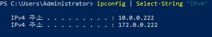
```
ipconfig | Select-String "IPv4"
```


#### 2. 라우팅 기능 On
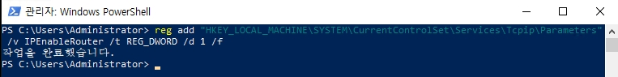
```
reg add "HKEY_LOCAL_MACHINE\SYSTEM\CurrentControlSet\Services\Tcpip\Parameters" /v IPEnableRouter /t REG_DWORD /d 1 /f
```
* 위 레지스트리를 변경한 후에 시스템을 재부팅합니다.
* 다른 목적지로 가는 패킷을 중계할 수 있게 라우팅 기능을 활성화합니다.

_RRAS를 설치하기 전, 양쪽 RRAS 서버에서 Ping으로 Hop과 통신 가능한지 확인합니다._

</br>

## 2. Corp A RRAS 역할 설치 및 설정

#### 1. IP 설정
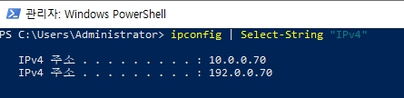
```
ipconfig | Select-String "IPv4"
```
<br>

#### 2. 라우팅 테이블 설정
```
route -p add 196.0.0.0 mask 255.255.255.0 10.0.0.222
route -p add 172.0.0.80 mask 255.255.255.0 10.0.0.222
```
* Corp B의 외부 망인 `172.0.0.80` IP와 내부망인 `196.0.0.0` 서브넷을 갈 경우, `10.0.0.222` 게이트웨이를 사용할 수 있게 설정합니다.
* _양 쪽 RRAS의 Ping 작업은 각각 라우팅 테이블 설정이 완료되면 가능합니다._

<br>

#### 3. 방화벽 추가
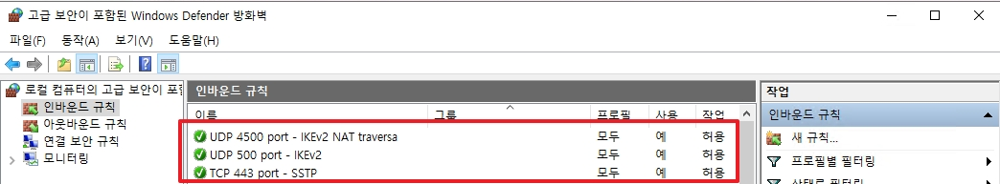
* TCP 443과 UDP 500 & 4500 Port를 개방합니다.

<br>

#### 4. RRAS 역할 설치
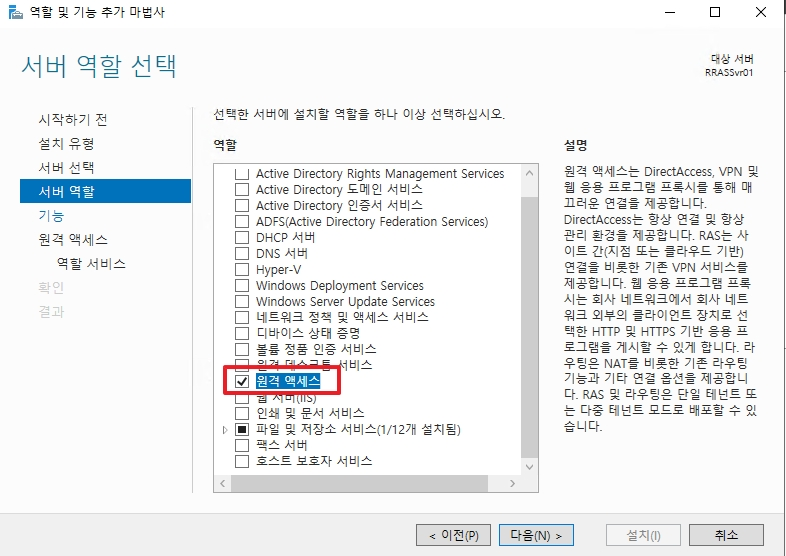
* `원격 엑세스` 역할을 설치합니다.

<br>

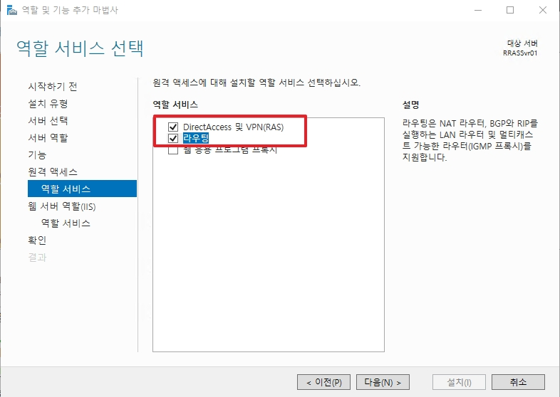
* `DirectAccess 및 VPN(RAS)`와 `라우팅` 서비스를 설치합니다.

</br>

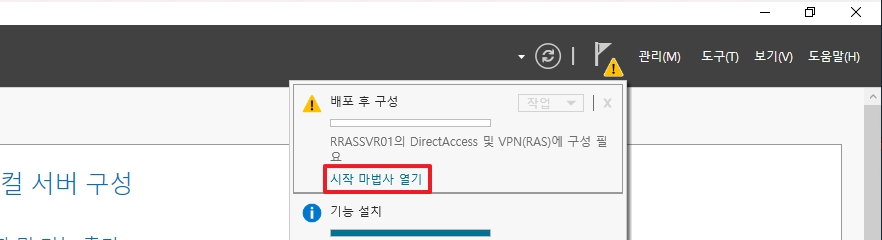
* `원격 엑세스` 시작 마법사 열기를 클릭합니다.

</br>

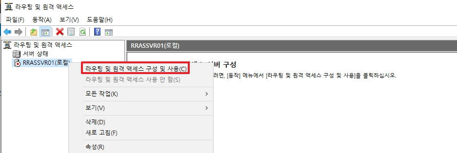
* 서버명을 우 클릭한 후, `라우팅 및 원격 엑세스 구성 및 사용`을 클릭합니다.

</br>

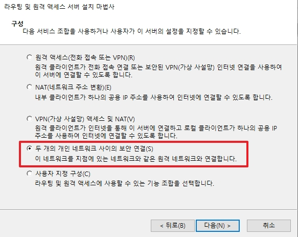
* `두 개의 개인 네트워크 사이의 보안 연결` 옵션을 선택합니다.

</br>

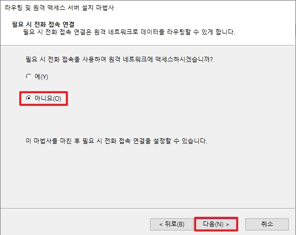
* 이후에 설정할 예정으로 `아니요`를 선택합니다.

</br>

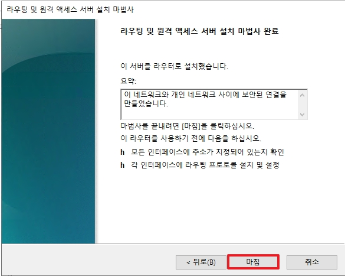
* S2S 역할 설치를 완료합니다.

</br>


* 활성화된 네트워크 인터페이스를 우 클릭한 후, `새 필요 시 전화 접속 인터페이스`를 클릭합니다.

</br>

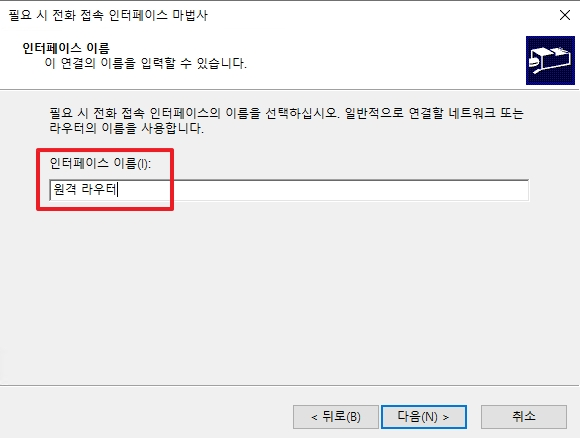
* 인터페이스 이름(= VPN) 이름을 설정합니다.

</br>

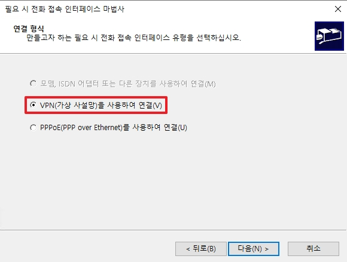
* `VPN` 옵션을 선택합니다.

</br>

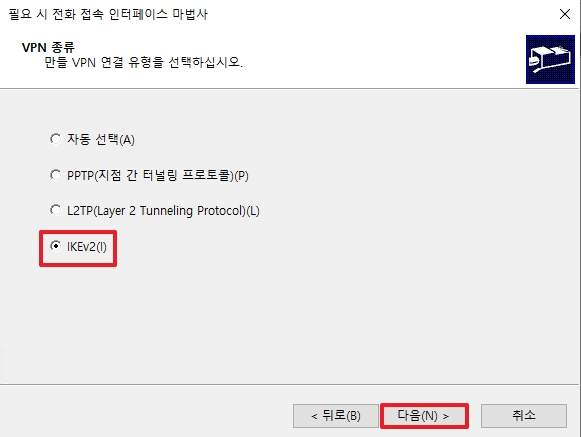
* `IKEv2` 옵션을 선택합니다.

</br>

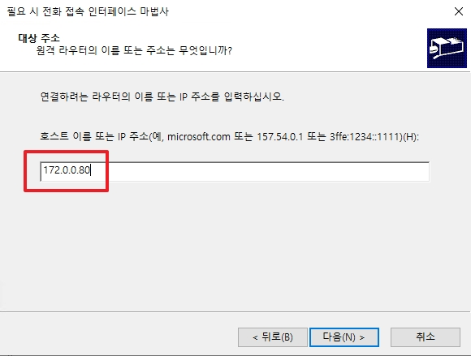
* 반대 쪽 RRAS IP를 입력합니다.
* Azure와 VPN S2S 구성이었다면 Azure VPN Gateway IP를 입력하여 주면 됩니다.

</br>

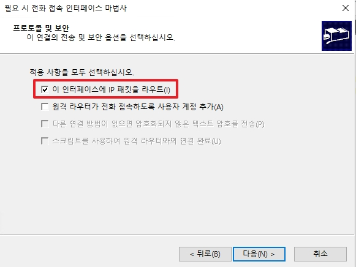
* `이 인터페이스에 IP 패킷을 라우트` 옵션만 선택합니다.

</br>

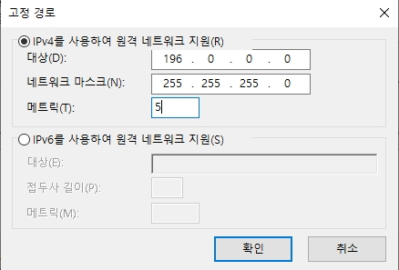
* Corp B의 서브넷 대역대와 게이트웨이 우선순위를 위한 매트릭 값을 입력합니다.

</br>

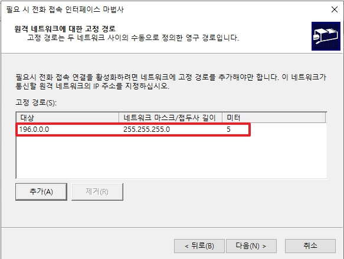
* Corp B 내부망 서브넷이 정상적으로 추가되면 다음으로 넘어갑니다.

</br>

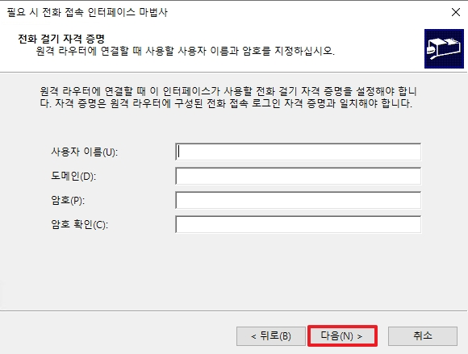
* 키 값(=비밀번호)을 통하여 통신할 예정으로 다음으로 넘어갑니다.

</br>

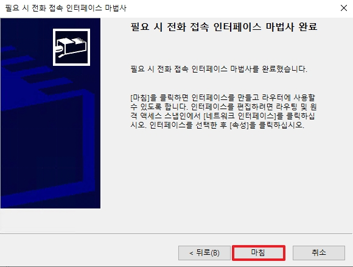
* VPN 옵션 설정을 완료합니다.

</br>

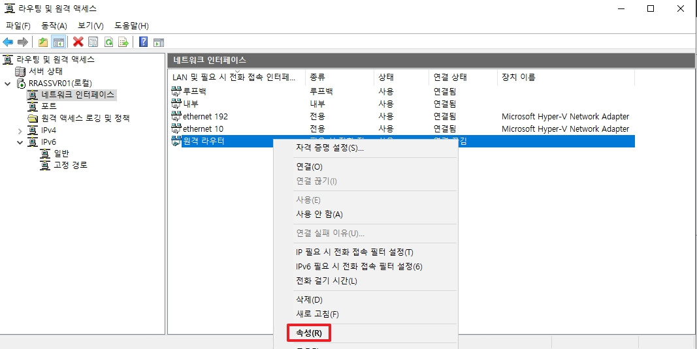
* 이전에 생성한 VPN 명을 우 클릭하여 속성을 클릭합니다.

</br>

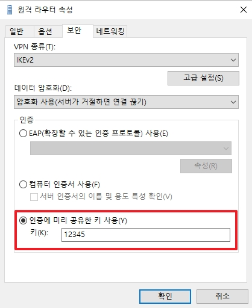
* `보안` 탭에서 키 사용 옵션을 체크한 후에 키 값(=비밀번호)를 입력합니다.

</br>

## 3. 