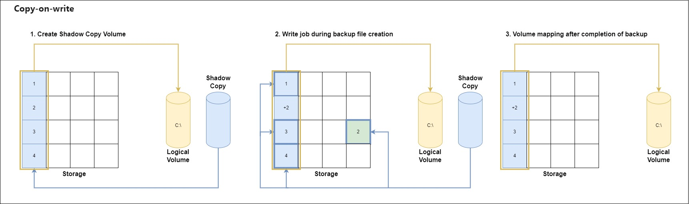
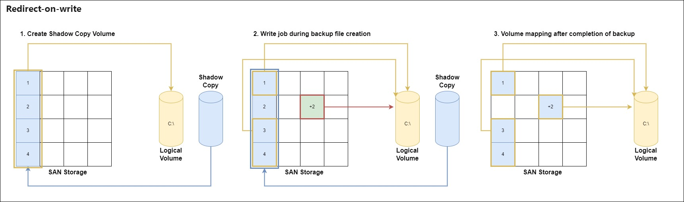
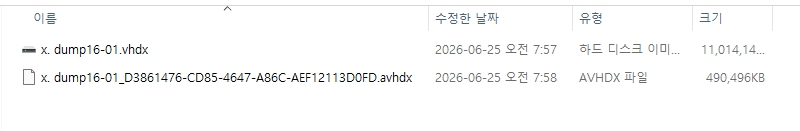

# Windows Server Backup

## VSS Works
우선 Windows에서는 백업을 진행할 때, VSS(Volume Shadow Copy Service)를 사용하여 진행하게 됩니다.  
따라서 이에 대한 기초적인 지식을 위하여 정리합니다.  

* `Requestor`: 백업을 요청하고, 최종 백업 파일을 생성 및 저장하는 솔루션
    * 솔루션: Veritas NetBackup, Veeam, Windows Backup 등등
* `Writer`: 백업 수행 시, 해당 애플리케이션의 데이터 일관성(정합성)을 보장해주는 역할
    * Application: SQL Writer, IIS Writer, Registry Writer 등등
* `Provider`: 실제로 디스크 블록을 제어하여 Shadow Copy Volume(스냅샷)을 구성하고 유지해주는 역할
    * 솔루션: Hyper-v, VMware, Dell, HPE, NetApp 등등  

 

  
[Reference] [https://learn.microsoft.com/en-us/windows-server/storage/file-server/volume-shadow-copy-service](https://learn.microsoft.com/en-us/windows-server/storage/file-server/volume-shadow-copy-service)

| 단계 | 흐름 | 설명 |
|------|------|------|
| 1 | Requestor → VSS | Snapshot 생성 요청 |
| 2 | VSS → Writers | Writer 메타데이터 수집 |
| 3 | Writers → VSS | 관리 대상(Component) 정보 제공 |
| 4 | Requestor → VSS | Snapshot Set 생성 시작 |
| 5 | VSS → Requestor | Snapshot 준비 완료 |
| 6 | VSS → Provider | Shadow Copy 생성 (`DoSnapshotSet`) |
| 7 | VSS → Writers | Thaw, I/O 재개 |

> Tip  
위 과정에서 VSS가 볼륨 카피를 진행하게 될때, 약 60초간 파일 시스템에서 발생하는 모든 Write I/O를 freeze 상태로 유지하게 됩니다.  
따라서 application 쪽에서 Writer가 구현이 안되어 있으면 60초간 파일에 데이터를 Write 하지 못 하기 때문에 종종 문제가 발생할 수 있습니다.    

 

그렇다면 60초간 Shadow Copy를 생성하면 백업이 완료된 것일까? 정답은 아닙니다.  
Provider를 통하여 백업할 볼륨을 Shadow Copy Volume으로 만들어서 OS 쪽에 마운트하게 됩니다.  
이때, 실제로 Shadow Copy Volume은 실제 데이터를 복사한 것이 아닌 원본을 매핑하여 보여주는 형태입니다.  

Requestor는 생성된 Shadow Copy Volume을 통하여 백업 파일을 생성하게 됩니다.  
그렇다면 백업하는 동안 원본 Data에 Write가 발생하면 Shadows Copy Volume에도 변화가 생길까요?  
이에 대한 일관성을 유지하기 위하여 `Copy-on-write`과 `Redirect-on-write`이 사용됩니다.  

## Copy-on-write

 
* 위 방식은 원본데이터를 가진 스토리지 블록에 Write가 발생하였을 때, 해당 위치에 데이터를 덮어씁니다.  
* 이전 데이터는 다른 블록에 할당한 후, Shadows Copy Volume에 매핑하여 일관성을 유지하여 줍니다.  
* 백업 파일 생성을 완료하여 Shadows Copy Volume을 unmount 했을 때, 이전 데이터를 저장할 때 사용한 블록들을 전부 초기화합니다.  

> 장점: 원본데이터들이 기존 블록에 Write를 하기 때문에 스토리지 입장에서 유지보수가 쉽습니다.  
단점: Write가 발생할 때마다, 다른 블록에 이전 데이터를 생성 및 매핑하여 줘야하기 때문에 백업 속도가 느립니다.  

## Redirect-on-write

 
* 위 방식은 Write가 발생하였을 때 기존 블록을 변경하지 않고, 새로운 블록에 갱신된 값을 write합니다.  
* Write 되어 신규 생성된 블록을 백업 대상인 Logical Volume에 매핑하여 줍니다.  
* 백업이 완료된 후에는 Write가 발생한 이전 블록들만 전부 초기화합니다.  

> 장점: 백업하는 기존 블록들에 변경이 없기 때문에 백업 속도가 매우 빠릅니다.  
(_대부분의 현대 백업은 위 RoW 방식으로 백업 됩니다._)  
 
단점: 백업 대상인 Logical Volume에 블록을 스토리지가 계속 매핑하여줘야 해서, 스토리지 입장에서 관리가 까다로우며 데이터 파편화가 발생합니다.  

 

### ++추가) Hyper-V 검사점  

Hyper-v에서는 실제로 RoW 방식을 사용하여 데이터 블록을 관리합니다.  

* `.vhdx`는 Write 되기 전인 실제 데이터 블록이며, `.avhdx`에는 Write가 발생하여 생성된 새로운 블록들이 저장되게 됩니다.  
* VM이 종료되면 Hyper-v는 .vhdx와 .avhdx를 병합하는 과정을 통해 데이터를 하나로 합치고 디스크 공간을 회수합니다.  