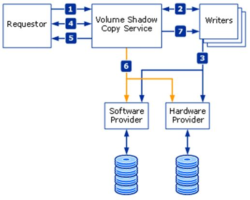

# Windows Server Backup

## VSS(Volume Shadow Copy Service)
우선 Windows에서는 백업을 진행할 때, VSS를 사용하여 진행하게 됩니다.  
따라서 이에 대한 기초적인 지식을 위하여 정리합니다.  

* Requestor: 백업을 요청하는 솔루션 역할
    * 솔루션: Veritas, Veeam, Windows Backup 등등
* Writer: 백업할 때, Application의 상태, 즉 정합성을 보장해주는 역할
    * Application: SQL Writer, IIS Writer, Registry Writer 등등
* Provider: 실제 백업한 데이터의 형태(Snapshot)을 만드는 역할  
    * 솔루션: Hyper-v, vmware, Netbackup 등등  

 

  
[Reference] [https://learn.microsoft.com/en-us/windows-server/storage/file-server/volume-shadow-copy-service](https://learn.microsoft.com/en-us/windows-server/storage/file-server/volume-shadow-copy-service)

| 단계 | 흐름 | 설명 |
|------|------|------|
| 1 | Requestor → VSS | Snapshot 생성 요청 |
| 2 | VSS → Writers | Writer 메타데이터 수집 |
| 3 | Writers → VSS | 관리 대상(Component) 정보 제공 |
| 4 | Requestor → VSS | Snapshot Set 생성 시작 |
| 5 | VSS → Requestor | Snapshot 준비 완료 |
| 6 | VSS → Provider | Shadow Copy 생성 (`DoSnapshotSet`) |
| 7 | VSS → Writers | Thaw, I/O 재개 |

위 과정에서 VSS가 볼륨 카피를 진행하게 될때, 약 60초간 파일 시스템에서 발생하는 모든 Write I/O를 freeze 상태로 유지하게 됩니다.  
따라서 application 쪽에서 Writer가 구현이 안되어 있으면 60초간 파일에 데이터를 Write 하지 못 하기 때문에 종종 문제가 발생할 수 있습니다.    

그렇다면 