# Windows Server Update Services

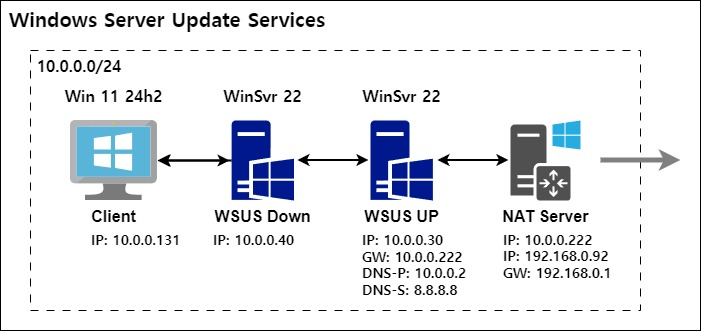


## 목차

1. [Upstream Server](#1-upstream-server)
2. [Synchronizations & Approving Windows Updates](#2-synchronizations--approving-windows-updates)
3. [Downstream Server](#3-downstream-server)
4. [AD WSUS GPO 배포](#4-ad-wsus-gpo-배포)

<br>

## 1. Upstream Server
실제로 외부에 있는 `Microsoft Update Server`에서 Update 관련 데이터들을 가져오는 서버이며,  
하위 WSUS 서버인 Downstream Server로 배포하는 서버입니다.  

#### 1. Windows Server Update Services 역할 추가
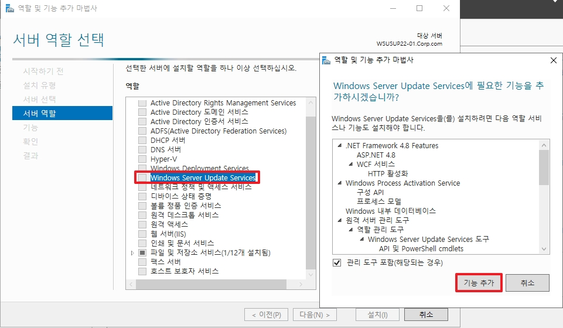  
* `서버역할`에서 `Windows Server Update Services`를 추가합니다.  

<br>

#### 2. 다음 이동
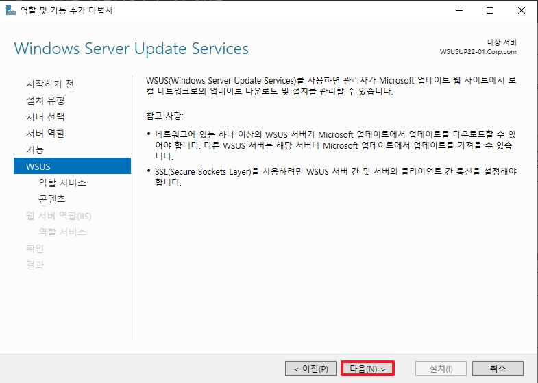  

<br>

#### 3. WSUS 업데이트 저장소 설정
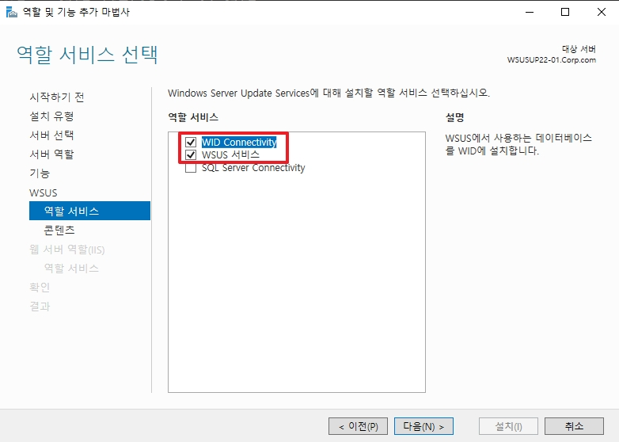  
* `WSUS 서비스`와 `WID Connectvity`를 선택합니다.
    * `WID Connectivity`: 업데이트 파일을 로컬에 저장합니다.
    * `SQL Connectivity`: 업데이트 파일을 SQL Server에 저장합니다.  

<br>

#### 4. 저장 경로 설정
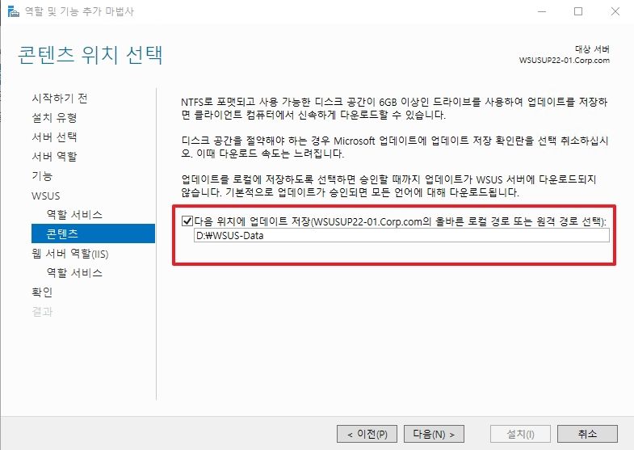  
* WID Connectvity의 로컬 저장 경로를 설정합니다.  

<br>

#### 5. 기능 설치
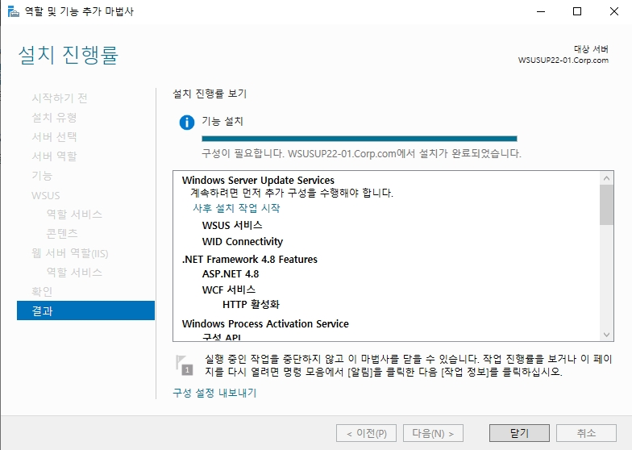  

<br>

#### 6. 사후 설치 작업 시작
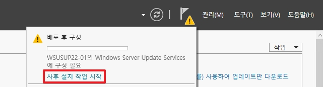  

<br>

#### 7. 다음 이동
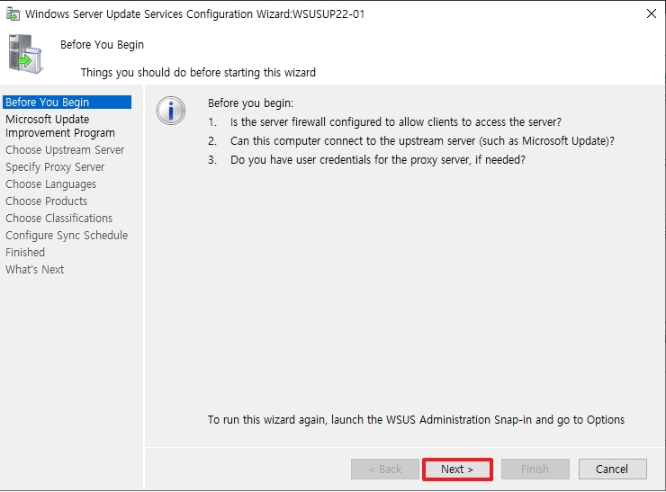  

<br>

#### 8. 오류 보고 기능 해제
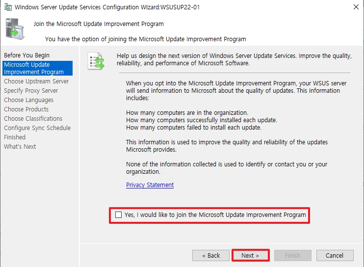  

<br>

#### 9. Microsoft Update 서버와 싱크
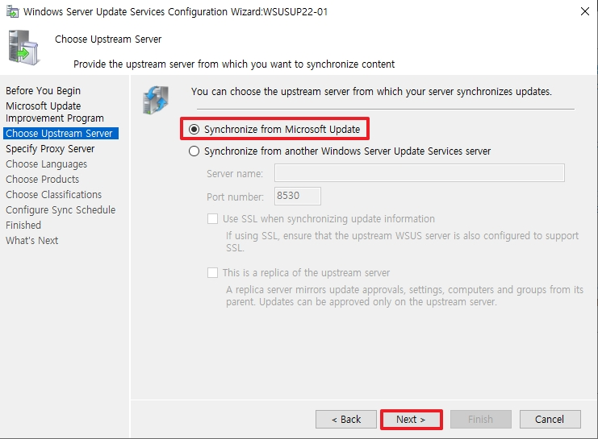
* 마이크로소프트 업데이트 서버와 동기화합니다.  

<br>

#### 10. 다음 이동
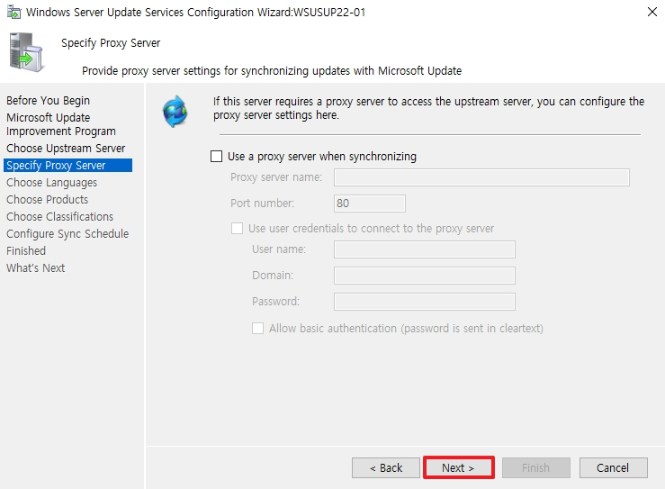  
* _프록시 서버가 있을 경우 설정합니다_.  

<br>

#### 11. 동기화 시작
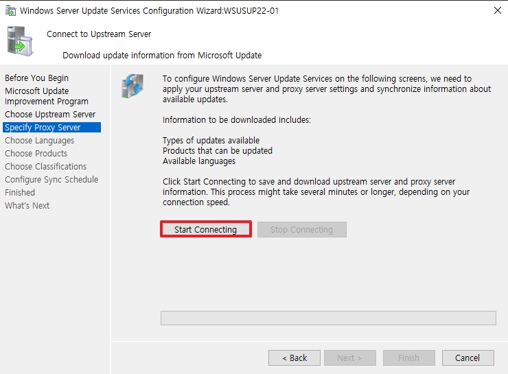  
* Microsoft Update 서버와 동기화을 시작합니다.  

<br>

#### 12. 다음 이동
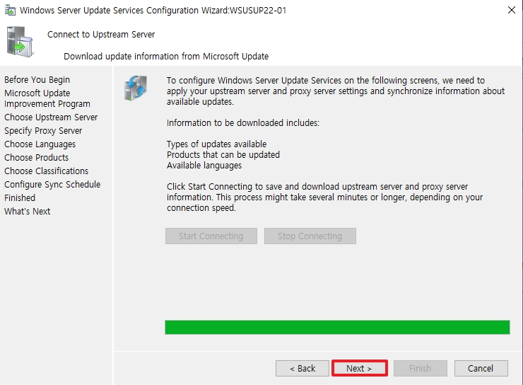  

<br>

#### 13. 업데이트 파일 언어 선택  
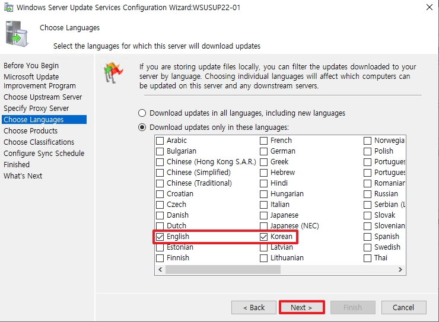  

<br>

#### 14. 배포할 업데이트 이미지 종류 선택
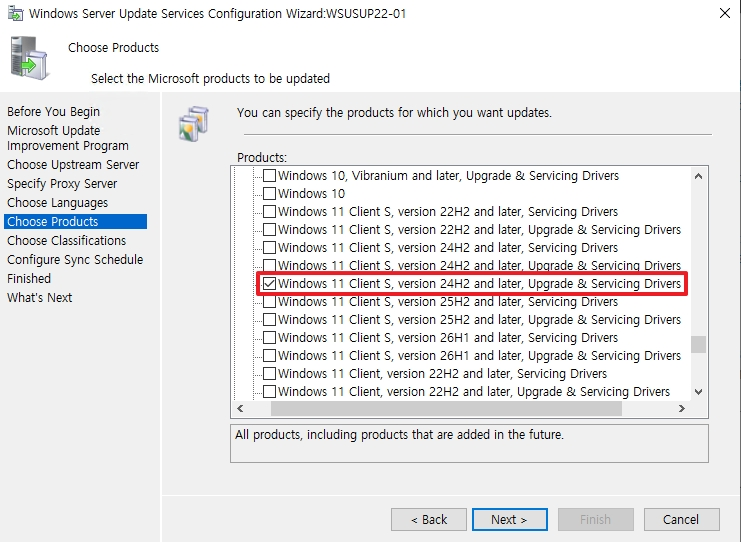  
* _해당 테스트는 windows 11 24h2를 기반으로 작성되었습니다._

<br>

#### 15. Classification
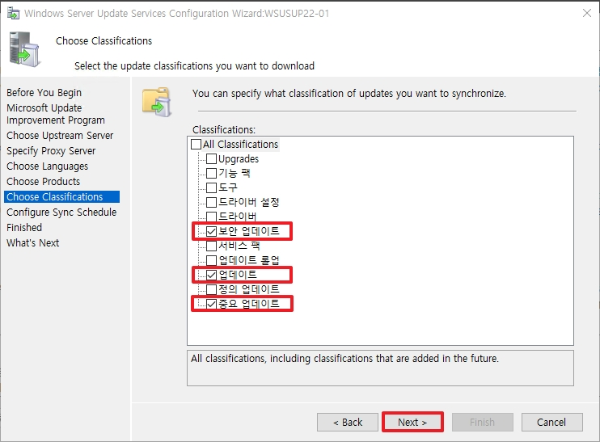  
[Reference] [https://learn.microsoft.com/en-us/intune/configmgr/sum/get-started/configure-classifications-and-products](https://learn.microsoft.com/en-us/intune/configmgr/sum/get-started/configure-classifications-and-products)


```
The default setting for products is all Windows products, and the default setting for classifications is critical and security updates.
```
[Reference] [https://learn.microsoft.com/en-us/windows-server/administration/windows-server-update-services/manage/setting-up-update-synchronizations](https://learn.microsoft.com/en-us/windows-server/administration/windows-server-update-services/manage/setting-up-update-synchronizations)
* 위 내용과 같이 우선 기본 값은 `중요 업데이트`와 `보안 업데이트` 입니다.  
    * _엄격히는 다르지만 보안 업데이트 부분이 일반적으로 설치하는 LCU라고 생각하면 편합니다._

<br>

#### 16. 자동 동기화 설정
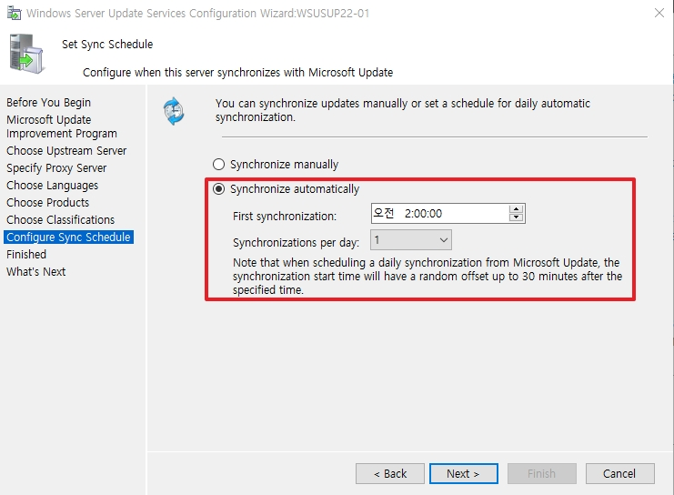  
* 최신 업데이트 목록을 수신하기 위하여 Microsoft Update 서버와 동기화할 시간대를 설정합니다.  

<br>

#### 17. 동기화 시작 
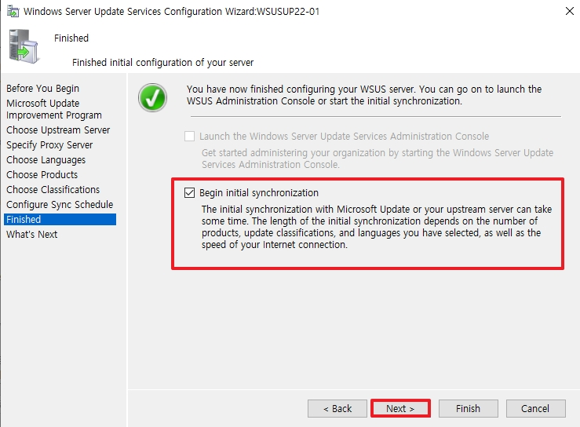  
* WSUS 구성 후, 바로 동기화를 시작합니다.  

<br>

#### 18. 구성 완료
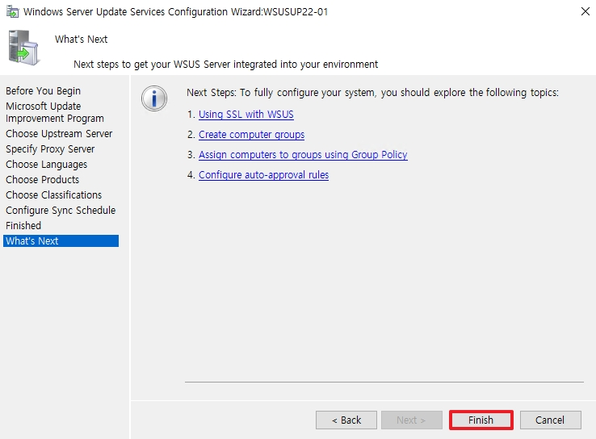  

<br>

### ++ 추가) MIME 추가

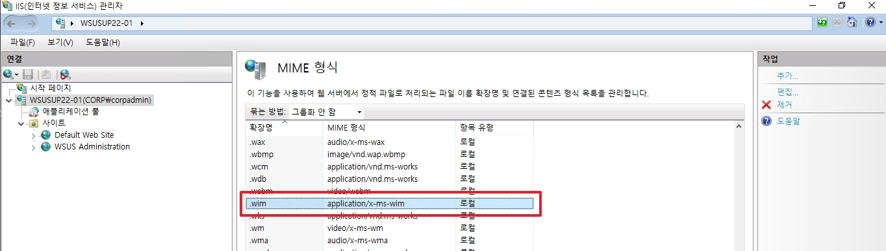
[Reference] [https://learn.microsoft.com/ko-kr/windows-server/administration/windows-server-update-services/plan/plan-your-wsus-deployment](https://learn.microsoft.com/ko-kr/windows-server/administration/windows-server-update-services/plan/plan-your-wsus-deployment)
```
파일 이름 확장자: .wim
MIME 형식: application/x-ms-wim

파일 이름 확장자: .msu
MIME 형식: application/octet-stream
```
* 위 2가지 파일 확장자를 추가해야 정상적으로 업데이트 파일을 다운로드 받을 수 있습니다.  
* _다운스트림 서버에서도 똑같이 설정합니다._

<br>

## 2. Synchronizations & Approving Windows Updates

#### 1. 상태 동기화  
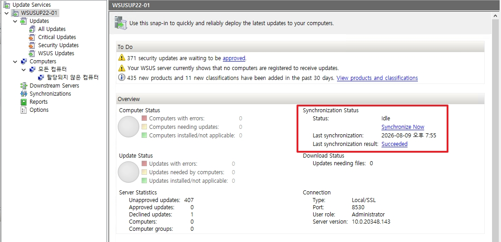
* `Last Synchronization result`를 통하여 동기화 상태 확인이 가능합니다.  

<br>

#### 2. Download 가능 Update 목록 확인  
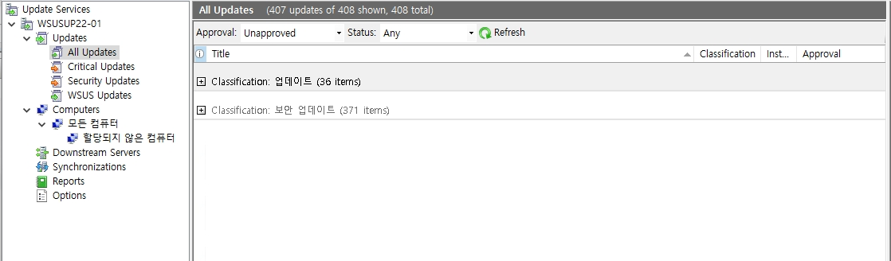  
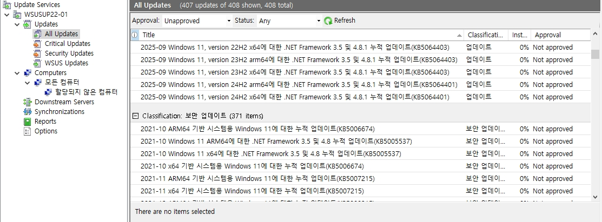


<br>

#### 3. Update Approve
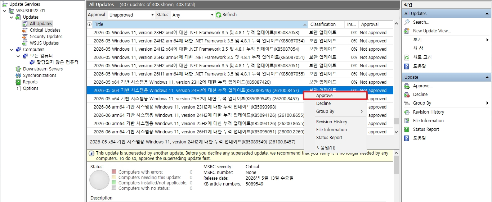
* 가져올 Update를 승인하여 Download 합니다.  

<br>

#### 4. 컴퓨터 그룹 승인
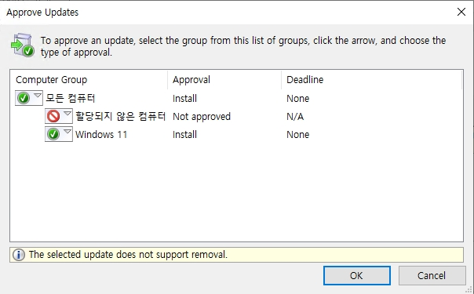
* 업데이트를 배포할 그룹을 선택하여 승인합니다.  

<br>

#### 5. 업데이트 확인
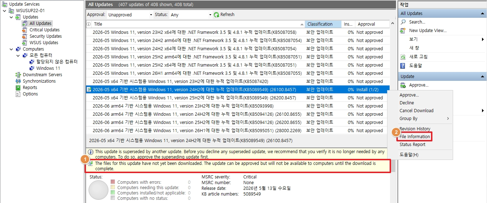
1. Update 파일의 다운로드가 완료되기 전까지 위와 같은 팝업창이 뜹니다.  
2. 속성창에서 보안 업데이트에 필요할 파일 목록들을 볼 수 있습니다.  

<br>

#### 6. Update File 정보
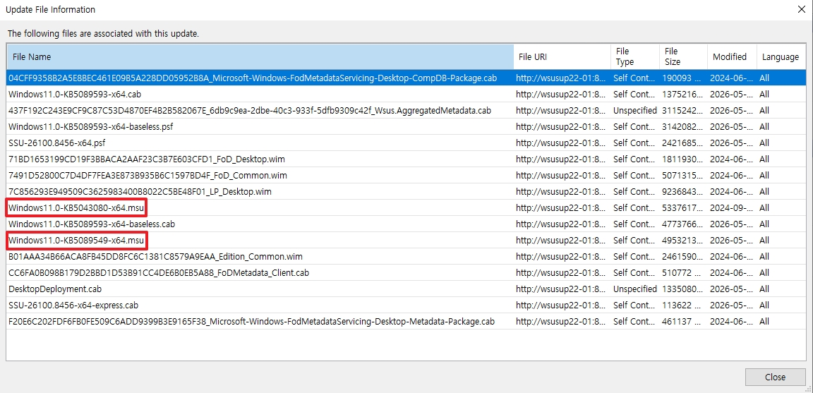
* 실제로 하나의 파일을 다운로드하는게 아닌 여러 개의 파일들을 다운로드하게 됩니다.  
* _여담으로 2024년 9월부터는 Windows 11에 체크 포인트라는 개념이 도입되어 있어서, 오프라인 설치 방법이 바뀝니다._
    * 링크: [https://support.microsoft.com/en-US/servicing/os/windows/2024/09/operation-is-not-supported-error-installing-a-post-checkpoint-update-by-double-clicking-the-msu-pack](https://support.microsoft.com/en-US/servicing/os/windows/2024/09/operation-is-not-supported-error-installing-a-post-checkpoint-update-by-double-clicking-the-msu-pack)

<br>

## 3. Downstream Server
_다운 스트림 서버는 위 업스트림 서버 설치방법과 거의 동일하여 바뀐부분만 기록합니다._

#### 1. 업스트림 서버 설정
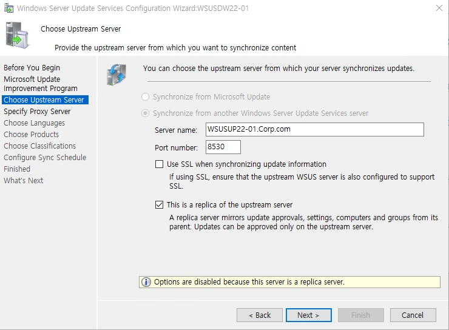
* 업스트림 서버의 FQDN을 입력합니다.  

<br>

#### 2. 언어 선택
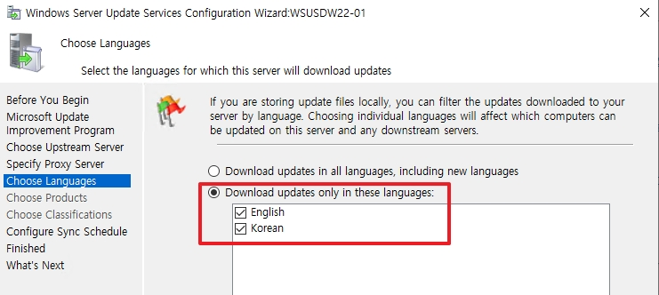
* 다운 스트림 서버는 업스트림 서버에서 다운로드 가능한 언어만 선택이 가능합니다.  

<br>

#### 3. 상태 동기화  
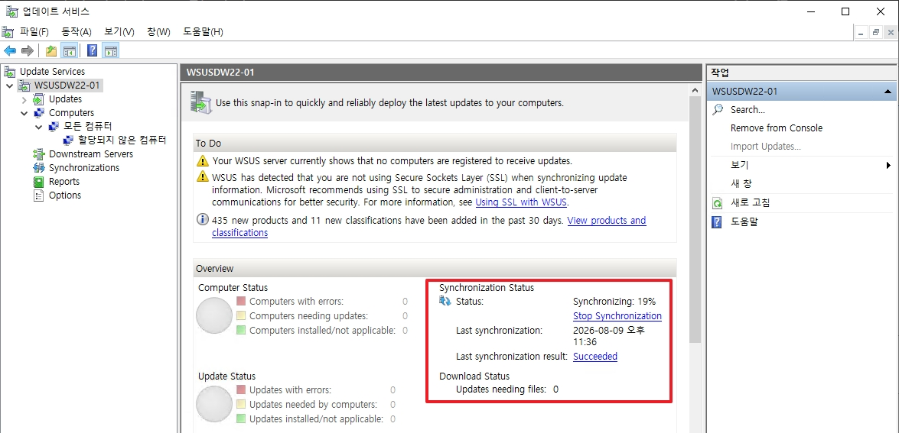
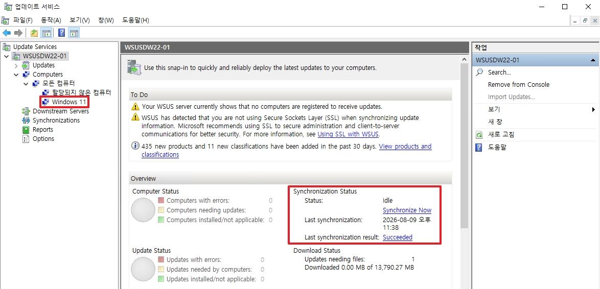
* 동기화가 정상적으로 완료되면, 업스트림 서버가 가지고 있는 컴퓨터 그룹 정보도 그대로 가져옵니다.  

<br>

#### ++) MIME 확장자 추가
위에서 언급한 것과 같이 `.wim`과 `.msu`를 추가해야 합니다.  
하지 않을 경우에 Client에서 아래와 같이 표기 됩니다.  

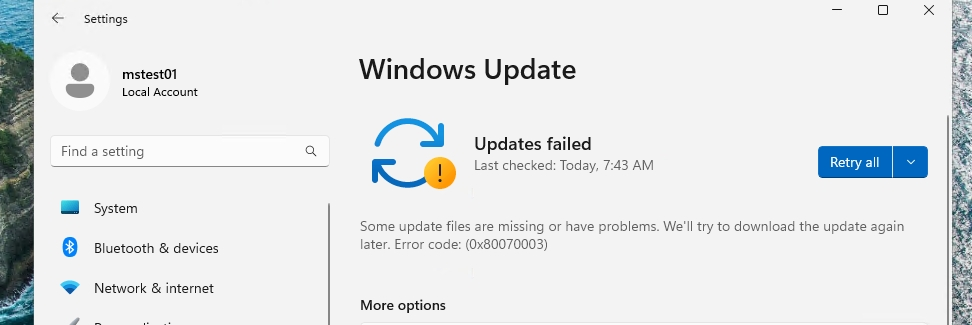
```powershell
# WindowsUpdate

2026/08/30 11:44:34.0790633 1336  8944  DownloadManager *FAILED* [80004001] Method failed [CAgentDownloadManager::CanRetryWithDifferentCDNForError:26108]
2026/08/30 11:44:34.0790674 1336  8944  DownloadManager Lock the sandbox of update 99677163-66E3-4FBD-910C-11861AC0DC28.100 (session data: (null))
2026/08/30 11:44:34.0790745 1336  8944  DownloadManager DO job {AC02BD30-0C61-49E4-BDBB-D2158B3D1C53} failed, updateId = 99677163-66E3-4FBD-910C-11861AC0DC28.100, hr = 0x80070003. File URL = http://wsusdw22-01.corp.com:8530/Content/FB/9A542B5813B003374532DCEEBA49B7E07C3FC2FB.msu, local path = C:\Windows\SoftwareDistribution\Download\77b9777c0600ac571d5742d053639204\Windows11.0-KB5089549-x64.msu, The response headers = 
2026/08/30 11:44:34.0792691 1336  8944  DownloadManager   Progress failure bytes total = 129553873, bytes transferred = 0
2026/08/30 11:44:34.0805840 1336  8944  Handler         OnDownloadJobFailure - UUP update 99677163-66E3-4FBD-910C-11861AC0DC28.100 in the sandbox C:\Windows\SoftwareDistribution\Download\77b9777c0600ac571d5742d053639204 failed with 0x80070003.
2026/08/30 11:44:34.0805877 1336  8944  Handler         OnDownloadJobFailure - UUP update 99677163-66E3-4FBD-910C-11861AC0DC28.100 found 1l downloaders.
2026/08/30 11:44:34.0839880 1336  8944  DownloadManager *FAILED* [80070003] Error occurred while downloading update 99677163-66E3-4FBD-910C-11861AC0DC28.100; notifying dependent calls.
```
* 위 로그와 같이 `.msu` 파일을 못 가져오는 것을 확인할 수 있다.  

<br>

## 4. AD WSUS GPO 배포  
_해당 챕터에서는 제일 기본적인 부분만 다룹니다._  

#### 1. 자동 업데이트 구성(1)
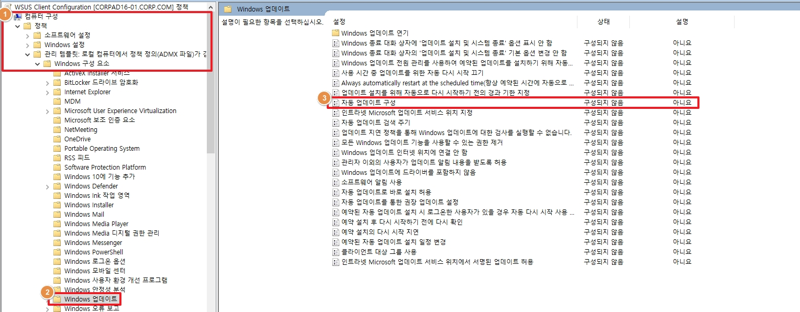
* __경로__: `컴퓨터 구성` -> `정책` -> `관리 템플릿` -> `Windows 구성 요소` -> `Windows 업데이트` -> `자동 업데이트 구성`
* 위 정책을 통하여 Client에서 언제 업데이트 다운로드 및 적용할지 정합니다.  

<br>

#### 2. 자동 업데이트 구성(2)
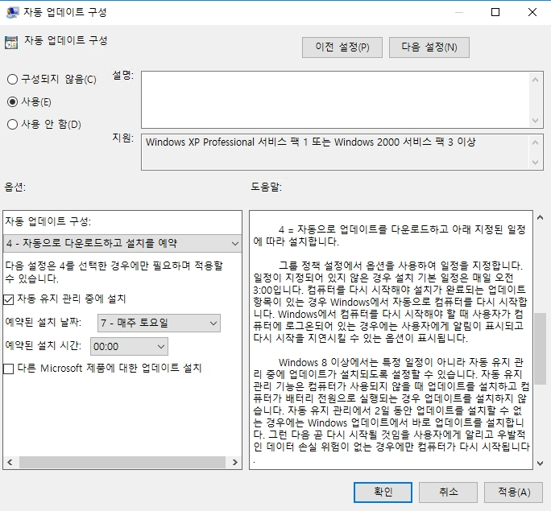
* _사내에서 자율적으로 업데이트 하도록하면 일반적으로 업데이트를 잘 하지 않는 경향이 있기 때문에 `4`번 옵션으로 합니다._  
* _사용자가 PC를 사용하지 않는 시간 동안에 다운로드 할 수 있도록 `자동 유지 관리` 중에 설치 옵션도 추가합니다._  

<br>

#### 3. 인트라넷 Microsoft 업데이트 서비스 위치 구성(1)
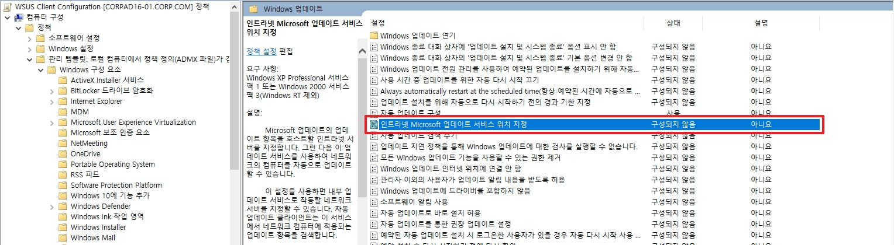
* 위 정책을 통하여 Client에서 WSUS 위치를 알 수 있게합니다.  

<br>

#### 4. 인트라넷 Microsoft 업데이트 서비스 위치 구성(2)
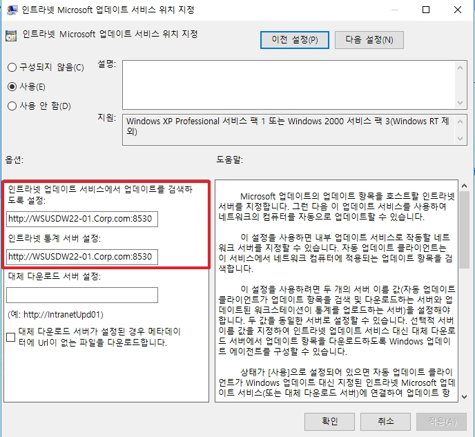
* 위 업데이트 서버와 통계 서버를 다운스트림 서버로 똑같이 설정합니다.  
* _다운스트림 서버가 복제본으로 되어 있어도 컴퓨터 그룹에 정상적으로 추가됩니다._

<br>

#### 5. 인트라넷 Microsoft 업데이트 서비스 위치 구성(3)
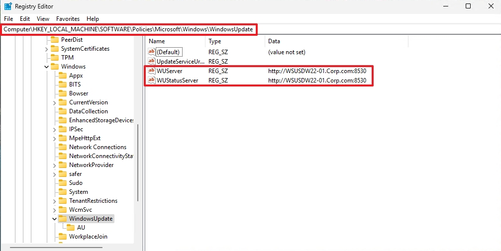
* 위치: Computer\HKEY_LOCAL_MACHINE\SOFTWARE\Policies\Microsoft\Windows\WindowsUpdate
* 위 정책을 적용하게 되면 Client에는 위와 같이 경로가 설정됩니다.  

<br>

#### 6. 컴퓨터 그룹 변경  
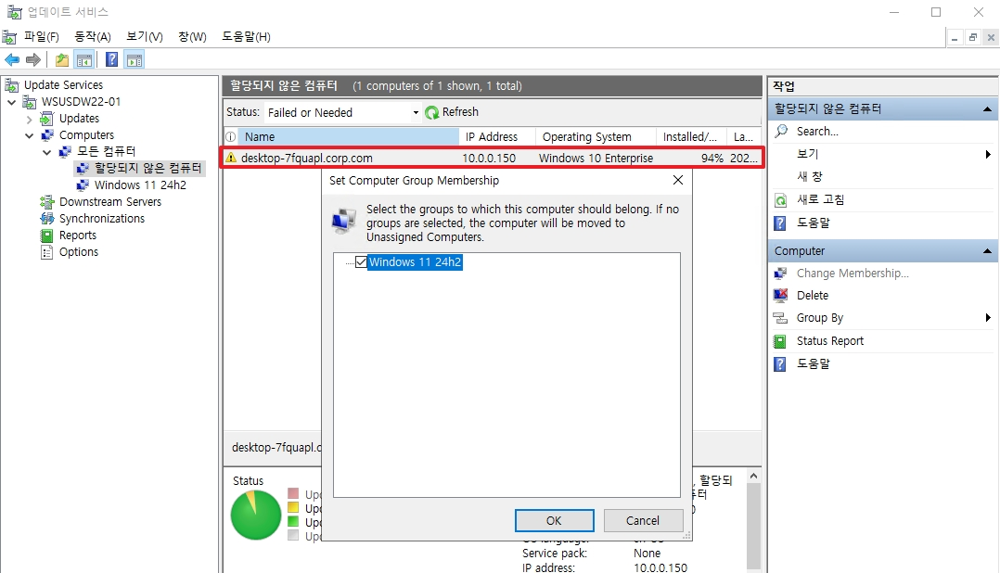
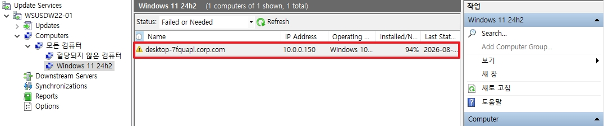
* 정책으로 설정하지 않을 경우, `할당 되지 않는 컴퓨터`에 Client PC가 등록되게 됩니다.  
* 따라서 위와 같이 그룹을 변경합니다.  

<br>

#### 7. Client PC Update  
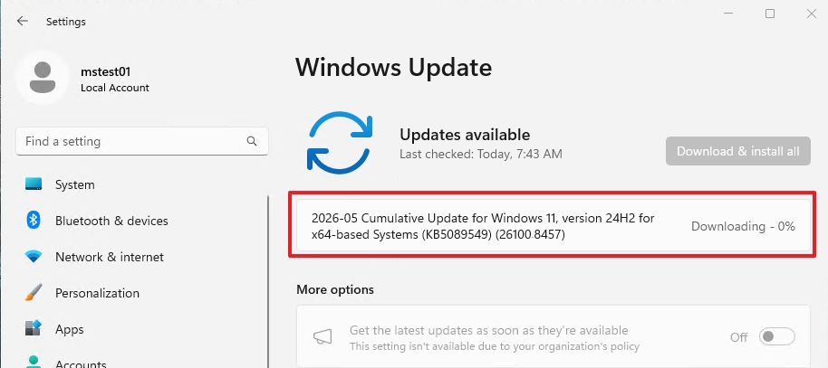  
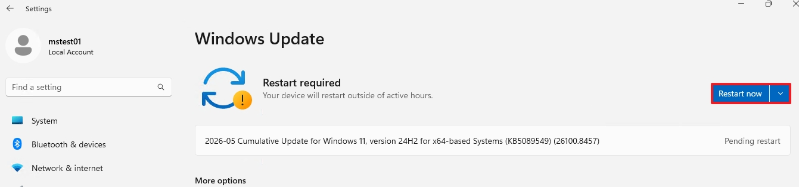
* 위 그룹을 변경하게 되면 정상적으로 PC에서 Windows Update가 가능합니다.  

<br>

#### 8. Update 확인  
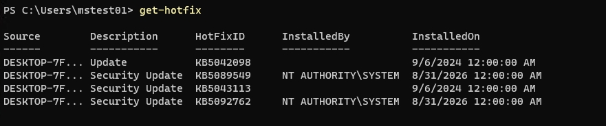
* 위와 같이 재부팅 후, 정상적으로 설치 됩니다.  

<br>

#### ++ 추가) 폐쇄망 환경에서 Windows Update
Windows에서는 WSUS에서 Update 파일 가져올 뿐, 다른 메타 데이터 정보들을 MS 서버로부터 가져오려 합니다.  
이를 생산망과 같은 환경에서 차단하기 위하여 아래와 같은 정책을 추가로 설정합니다.  

#### 1. Windows 업데이트 인터넷 위치에 연결 안 함
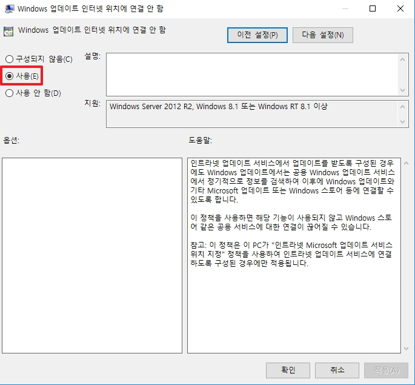
* __경로__: `컴퓨터 구성` -> `정책` -> `관리 템플릿` -> `Windows 구성 요소` -> `Windows 업데이트` -> `Windows 업데이트 인터넷 위치에 연결 안 함`
* 위 정책을 통하여 Microsoft Update 서버와 통신을 차단합니다.  

<br>

#### 2. MS Store 사용 불가
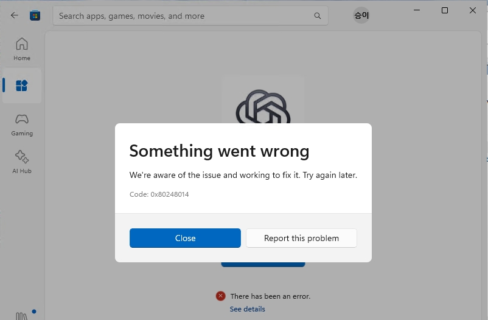
* 사내망에서 위 정책을 사용할 경우, 위와 같이 로그인은 되어도 추가적인 사용에 제약 걸릴 수 있습니다.

<br>

## 5. 도메인 외부에서 WSUS 구성
_사내에서 사용하는 PC가 도메인에 가입되지 않을 경우에는 아래와 같이 세팅하면 사내 WSUS를 사용 가능합니다._  

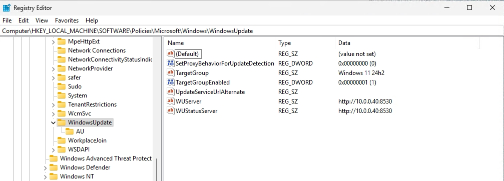
| Name | Type | Data |
|---|---|:---:|
| SetProxyBehaviorForUpdateDetection | REG_DWORD | 0x00000000 (0) |
| TargetGroup | REG_SZ | 컴퓨터 그룹 이름 |
| TargetGroupEnabled | REG_DWORD | 그룹 지정 시 1, 아니면 0 |
| UpdateServiceUrlAlternate | REG_SZ | 공백 |
| WUServer | REG_SZ | WSUS 주소 및 포트 |
| WUStatusServer | REG_SZ | WSUS 주소 및 포트 |
* 위치: Computer\HKEY_LOCAL_MACHINE\SOFTWARE\Policies\Microsoft\Windows\WindowsUpdate

<br>

#### 2. WSUS 사용 옵션 활성화  
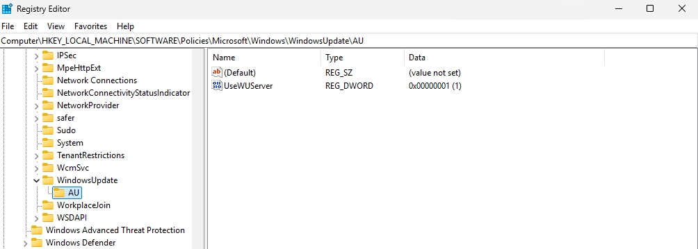
* 위 레지스트리 값을 추가해야 pc가 wsus에서 Update를 가져옵니다.  

#### 3. Client 그룹 지정 허용
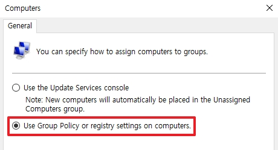
* WSUS 콘솔 경로: `Options` -> `Computers`
* 위 옵션을 WSUS에서 변경해야 Client PC가 레지스트리에 설정한 그룹으로 자동 가입합니다.  

<br>

## ++추가) 다운스트림 서버에서 파일이 다운로드 되지 않을 경우  

### 1. 필요한 파일 다시 다운로드 시도
```cmd
cd "C:\Program Files\Update Services\Tools"
WsusUtil.exe reset
```
* 종종 하위 스트림 서버에서 싱크는 잘 되지만 업데이트 파일이 다운로드 되지 않는 경우가 있는데, 위 명령어로 다시 시도합니다.   

<br>

### 2. 다운스트림 서버의 기본 게이트웨이를 설정하지 않은 경우

```powershell
C:\Program Files\Update Services\Tools>bitsadmin /list /allusers /verbose


GUID: {ABFF2560-6C24-4459-88F2-1B8795097494} DISPLAY: '379e0308-49e3-4533-89c2-0d4243866b88'
TYPE: DOWNLOAD STATE: TRANSIENT_ERROR OWNER: NT AUTHORITY\NETWORK SERVICE
PRIORITY: HIGH FILES: 0 / 1 BYTES: 0 / UNKNOWN
CREATION TIME: 2026-08-10 오전 10:09:54 MODIFICATION TIME: 2026-08-10 오전 10:09:54
COMPLETION TIME: UNKNOWN ACL FLAGS:
NOTIFY INTERFACE: UNREGISTERED NOTIFICATION FLAGS: 3
RETRY DELAY: 600 NO PROGRESS TIMEOUT: 86400 ERROR COUNT: 0
PROXY USAGE: NO_PROXY PROXY LIST: NULL PROXY BYPASS LIST: NULL
ERROR FILE:    http://WSUSUP22-01:8530/Content/7E/437F192C243E9CF9C87C53D4870EF4B2B582067E.cab -> D:\WSUS-Data\WsusContent\7E\437F192C243E9CF9C87C53D4870EF4B2B582067E.cab
ERROR CODE:    0x80200010 - 현재 활성 네트워크 연결이 없습니다. 어댑터가 연결되면 BITS(Background Intelligent Transfer Service)가 다시 시도합니다.
ERROR CONTEXT: 0x00000002 - BITS(Background Intelligent Transfer Service) 큐 관리자에 오류가 발생했습니다.
DESCRIPTION: SUSFile
```
* 위 코드와 같이 `0x80200010`와 `0x00000002`가 발생할 경우는 WSUS 하위 스트림 서버에 기본 게이트웨이가 설정도지 않았을 경우에 발생합니다.  
* 같은 서브넷 대역이라 게이트웨이를 설정하지 않더라도 BITS 서비스가 게이트웨이가 없으면 네트워크가 없다고 인식합니다.   


### 3. SusClientId 값 확인 및 

#### 1. Client에서 확인
```cmd
PS C:\Windows\system32> reg query "HKLM\SOFTWARE\Microsoft\Windows\CurrentVersion\WindowsUpdate" /v SusClientId

HKEY_LOCAL_MACHINE\SOFTWARE\Microsoft\Windows\CurrentVersion\WindowsUpdate
    SusClientId    REG_SZ    2c7180f1-ae05-4596-8c28-a37e74894c46
```

#### 2. WSUS에서 확인(WID 사용할 경우만)
```powershell
PS C:\Users\corpadmin> $wsus.GetComputerTargets() |
>>     Select-Object -First 2 |
>>     Format-List *

UpdateServer              : Microsoft.UpdateServices.Internal.BaseApi.UpdateServer
Id                        : 2c7180f1-ae05-4596-8c28-a37e74894c46
FullDomainName            : desktop-eco64u3
IPAddress                 : 10.0.0.150
Make                      : Microsoft Corporation
Model                     : Virtual Machine
BiosInfo                  : Microsoft.UpdateServices.Administration.BiosInfo
OSInfo                    : Microsoft.UpdateServices.Administration.OSInfo
OSArchitecture            : AMD64
ClientVersion             : 1308.2408.1052.0
OSFamily                  : Windows
OSDescription             : Windows 10 Enterprise
ComputerRole              : Workstation
LastSyncTime              : 2026-09-01 오후 1:14:12
LastSyncResult            : Succeeded
LastReportedStatusTime    : 2026-09-01 오후 1:16:01
LastReportedInventoryTime : 0001-01-01 오전 12:00:00
RequestedTargetGroupName  :
RequestedTargetGroupNames : {}
ComputerTargetGroupIds    : {b73ca6ed-5727-47f3-84de-015e03f6a88a, a0a08746-4dbe-4a37-9adf-9e7652c0b421}
ParentServerId            : 00000000-0000-0000-0000-000000000000
SyncsFromDownstreamServer : False
```

#### 3. Client 측, Windows Update Agent 초기화  
```cmd
sc stop wuauserv
sc start wuauserv
wuauclt.exe /resetauthorization /detectnow
wuauclt /reportnow
```
[Reference] 
1. [https://learn.microsoft.com/es-es/security-updates/windowsupdateservices/issueswithclientcomputergroups-21741409](https://learn.microsoft.com/es-es/security-updates/windowsupdateservices/issueswithclientcomputergroups-21741409)
2. [https://learn.microsoft.com/ko-kr/troubleshoot/mem/configmgr/update-management/troubleshoot-issues-with-wsus-client-agents](https://learn.microsoft.com/ko-kr/troubleshoot/mem/configmgr/update-management/troubleshoot-issues-with-wsus-client-agents)